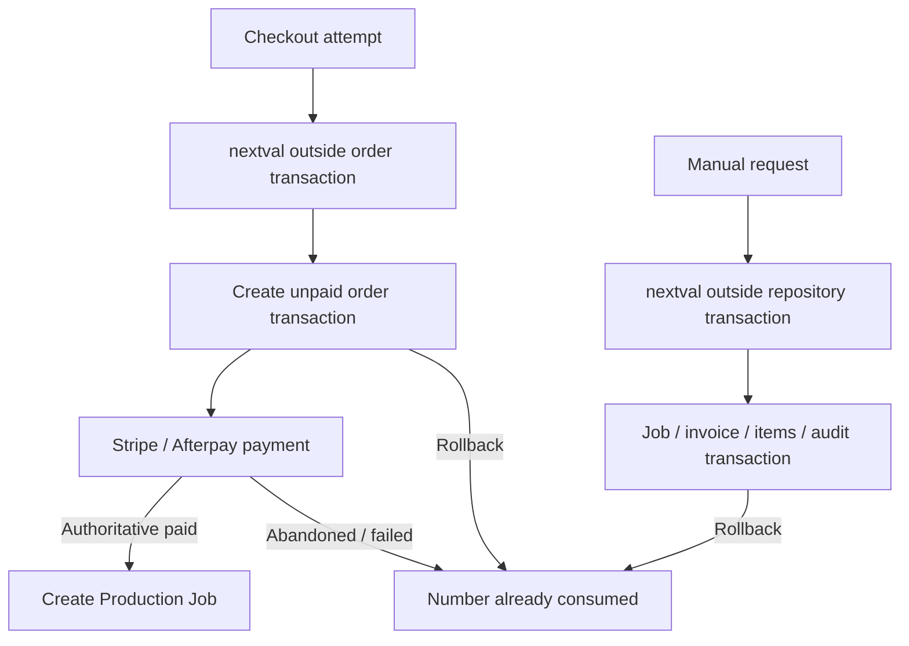
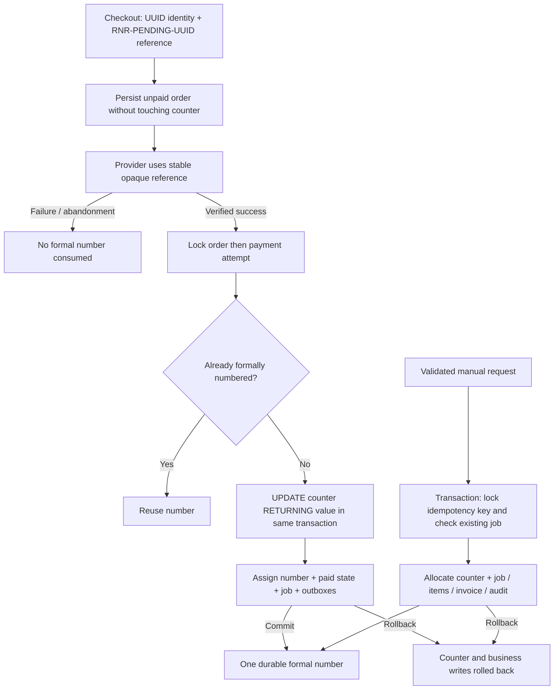

# Transactional Order / Job numbers — local implementation

Status: local implementation and verification only. No commit, push, Preview, Production migration, Production deployment, environment change, or role creation was performed.

## 1. Confirmed root causes and read-only audit

Baseline: `804196c76534893783f9180205e381f6ea5022bb` (`origin/main`, fetched before work). At the initial read-only check both Production domains resolved to READY deployment `dpl_E1n1FHZxAnBmbyLptgsVBRfopnet`, `githubCommitRef=main`, with this SHA. This is an initial observation, not a future release check. The original checkout and its unrelated dirty knowledge file were preserved; implementation is in `.worktrees/business-number-20260921`, branch `codex/business-number-20260921`.

| Audit item | Confirmed code path / result |
| --- | --- |
| Sequence callers | `src/server/orders/order-number.ts` was the only application SQL `nextval` call. Checkout route and admin production runtime both injected it as a service callback. Schema declarations and historical migrations also name the sequence. |
| Order creation | `POST /api/checkout/order` → `createOrderService` → allocator **before** `createAtomicOrder` → order/items/addresses and checkout completion transaction. |
| Order number updates | No pre-existing renumbering path. This change adds only new-order finalization in the locked direct-payment and order-balance-payment transactions. Admin/proof/tracking updates retain their behavior. |
| Production job creation | Manual: `production-job-service` → `drizzle-production-job-repository.createManual`. Web: `ensurePaidWebOrderProductionJob` in direct-payment repository, inside payment transaction; unpaid snapshots return null. |
| Stripe | `paymentTargetReference` feeds PaymentIntent `metadata.order_number`; request payments use `metadata.merchant_reference`. Verification compares exact reference, amount, currency and provider identity. |
| Afterpay | `paymentTargetReference` feeds checkout/capture `merchantReference`, trusted return URL and retrieval/capture checks. |
| Invoice | `buildInvoiceNumber(jobNumber)` produces `INV-<jobNumber>`. Manual `DRAFT` reference was resolved before the repository transaction. Automatic drafts load an existing job. |
| Paid transaction boundary | `lockOrderThenAttempt`: order `FOR UPDATE`, then attempt `FOR UPDATE`; `applyLockedVerifiedResult` updates payment/order, job/items and notification outboxes. Webhook event deduplication is in the same outer transaction. Existing automatic invoice savepoint isolates invoice failure from an authoritative payment. |
| Additional paid path | Order-linked Payment Requests and confirmed bank transfers update the order from its ledger balance in `drizzle-payment-request-repository`. They also require finalization for newly created opaque orders. |
| Physical deletion | `deleteManual` deletes invoice/job rows and writes `production_job.deleted`, preserving `before_summary.jobNumber`. Successful allocations remain reserved after deletion. |
| Historical gap attribution | **07309–07325: UNKNOWN — historical Production database audit unavailable.** Vercel returned a Sensitive placeholder; no database connection or SQL was executed. The temporary env file was deleted. No further extraction was attempted after the user prohibited it. |

PostgreSQL documents that `nextval` is not rolled back: [CREATE SEQUENCE](https://www.postgresql.org/docs/18/sql-createsequence.html). A rollback can therefore consume a sequence value; pre-payment persisted orders and deleted manual jobs are two additional independent explanations. No specific explanation is asserted for any of the 17 historical numbers.

## 2. Old flow

## 3. New flow and storage choice

UUID primary identities remain unchanged. To preserve existing routes and DTO contracts, `orders.order_number` remains a non-null string: new unpaid orders carry an opaque `RNR-PENDING-<UUID>`, not a formal numeric number. New nullable/unique `orders.payment_reference` preserves that exact initial reference permanently. Historical rows retain `payment_reference=NULL` and their original number without backfill.

For a new order, equality of its non-null payment reference and order number identifies the unfinalized state. The authoritative locked paid transaction replaces only `order_number` with the next formal number. Afterward these differ; every retry reuses the committed number. Legacy rows have no payment reference and never get renumbered. The allocator's TypeScript API requires a transaction; it issues an atomic row `UPDATE`, never `MAX()+1` or `nextval`.

## 4–6. Migration, SAFE FLOOR and guards

Migration: `drizzle/0069_transactional_business_numbers.sql`; appended journal entry and matching scoped snapshot. Earlier SQL, journal entries and snapshots are unchanged. Drizzle generation exposed unrelated existing snapshot drift; unrelated generated DDL was excluded, and the new snapshot carries only this change over snapshot 0068.

The guarded migration:

1. Serializes cutover with a transaction advisory lock.
2. Renames `rnr_order_number_seq` to `rnr_order_number_seq_retired`, retaining its state. Both names existing, or the historical sequence missing, cause failure. This disables the old name so stale application allocators fail closed rather than collide with the counter.
3. Locks relevant source tables against writes while computing the floor.
4. Adds `business_number_counter(key text PRIMARY KEY, current_value bigint NOT NULL CHECK >= 0)` and unique nullable `orders.payment_reference`.
5. Calculates `GREATEST(sequence.last_value, MAX(recognized numeric identifiers), 0)` from:
   - `orders.order_number`;
   - `production_jobs.job_number` and `web_order_number`;
   - `invoices.invoice_number`, `reference`, `web_order_number` (digits and `INV-<digits>`);
   - `order_system_migration_journal.source_ref_no`, including failed/rolled-back historical entries;
   - audit before/after summaries: `jobNumber`, `orderNumber`, `invoiceNumber`, `reference`, `webOrderNumber`;
   - persisted internal-notification `resource_reference`.
6. Does not subtract one when `is_called=false`; preserves sequence reservations including unused cached values. Empty numeric datasets use the sequence floor. Values beyond the usable bigint range fail closed.
7. Upserts `order_job` using the greater of the seed and any existing counter. Re-execution never lowers the counter. `current_value` means highest used/reserved value; next allocation is `current_value+1`.
8. If the existing `rnr_app_runtime` role exists, grants only SELECT/UPDATE on the new counter table. It does not create a role or change existing table permissions. Executing this new-object grant is part of the Production migration approval, not something already applied.

No historical numbers or gaps are reclaimed. Payment Request `PAY-<year>-<opaque suffix>` references use a separate random namespace; they are not formal Order/Job numbers. Customer data, payment evidence, unpaid orders and historical migration records are not deleted or rewritten.

**Cutover requires a coordinated maintenance window.** Stop and drain old checkout/manual writers before migration; prevent old-instance business writes during the Git-triggered deployment. Renaming the sequence deliberately makes old allocators unavailable until the new app is live. This is not a zero-downtime rolling migration. Do not run it while ordinary checkout traffic is being admitted. The runtime no longer uses the retired sequence.

## 7–8. Stripe and Afterpay

- New provider references are opaque and stable before and after finalization. Existing provider metadata keys, PaymentIntent IDs, attempt idempotency keys, return-state signatures/digests and UUID relationships remain unchanged.
- Historical numeric or RNR references continue to verify unchanged.
- Webhook parsing still validates the provider payload; amount/currency/reference checks are not relaxed.
- Same event, different events for the same PaymentIntent, payment-return retry, Afterpay capture retry and reconciliation all converge on the locked order and existing formal number.
- No provider secret/configuration was changed. Tests use synthetic payloads; no live Stripe/Afterpay capture was performed.

## 9. Manual order and deletion

Normal admin runtime no longer injects an allocator outside the transaction. The repository serializes matching idempotency keys, returns an existing job before allocating, validates database-backed custom fields, then allocates and writes job/items/invoice/audit/outboxes together. Subsequent failure rolls back the increment.

Existing physical Delete behavior is unchanged. A successfully allocated number remains consumed forever even if its job is deleted. Therefore this fixes wasted numbers from checkout/payment failure/rollback, not gaps intentionally caused by later deletion. A separate product approval would be needed to replace Delete with cancelled/archived semantics; that is the smallest recommended future policy change.

## 10. Invoice and notification behavior

Manual invoice numbers and default DRAFT references are derived from the number allocated inside the repository transaction. Draft validation/calculation does not allocate. Existing explicit invoice references remain intact.

Automatic web/manual invoice creation retains its savepoint behavior: automatic invoice failure does not undo an otherwise successful formal order. Scheduling occurs after the outer repository transaction commits. The new order-balance payment path also creates the formal job/invoice and enqueues the normal customer/internal paid-order outboxes atomically. Separate Payment Request receipts retain their existing behavior. Pending failure notifications are removed on paid finalization.

## 11. Backwards compatibility

- Historical order/job/invoice numbers are unchanged; no unpaid orders removed.
- Customer and account queries accept either the current order number or retained payment reference, with existing owner/cookie/email-token checks intact.
- Order detail displays the formal number after payment; payment panel keeps the original reference for browser recovery/cart cleanup and uses the canonical numbered destination URL. Proof access uses the canonical number.
- Admin order identity/detail routes use UUID; lists read the current string number. Before payment the string is an opaque reference; afterward it is the formal number.
- Email outboxes load the committed order number. Previously issued pre-payment email links remain resolvable by the retained reference and signed-access validation.
- Meta paid-order lookup accepts the retained reference but builds the conversion from the canonical paid record. Existing ledger/attempt UUID idempotency remains intact.
- Formatting: 7327 → `07327`; 99999 → `99999`; 100000 → `100000`. No SQL `lpad(...,5)` truncation.

## 12–13. Local verification

Verification completed on disposable localhost PostgreSQL 18, migrated using the repository canonical migration runner. No Production credentials or database were used.

| Check | Result |
| --- | --- |
| Scoped unit / route / UI / schema tests | PASS across batches: 24 files; 472 initial tests included one stale journal-count assertion, corrected and rerun (14/14); four new recovery cases and affected follow-up passed (83/83). 476 distinct cases in final scoped coverage. |
| Real PostgreSQL integration | PASS: six files 99/99, then affected payment/request files 58/58 after one additional test and paid-outbox fix; 100 distinct cases in final coverage. |
| Concurrency / rollback | PASS: simultaneous allocations and distinct paid orders, duplicate manual requests, whole-transaction rollback and retry. |
| Provider / webhook idempotency | PASS: Stripe duplicate and distinct events, Afterpay retry/reconciliation, recovery/return state, historical numbered orders, bank/order-linked request payment. |
| Migration | PASS: canonical migration runner on two disposable databases; dynamic floor sources, empty numeric history, repeated migration without lowering counter; drizzle-kit check. |
| Typecheck | PASS: npm run typecheck. |
| Affected lint | PASS: 35 changed TypeScript/TSX files. |
| Production-mode build | PASS: npm run build, exit 0. Two earlier attempts stopped at local auth configuration (missing BETTER_AUTH_URL, then an origin rejected by Staff Passkeys); final run used the existing accepted staging origin, an in-memory random build-only secret and localhost DB. No auth checks changed. |
| Patch whitespace | PASS: git diff --check. |
| Independent code review | Reviewer found a missing paid-outbox path for bank/order-linked requests; fixed and regression-tested. Follow-up found no remaining actionable issue in that narrow scope. |

No full repository suite, Preview deployment or live provider payment was run. The complete Production release gate is still pending. Build-generated knowledge metadata was restored only in this isolated worktree, preserving the original checkout's unrelated modification.

Changed files (relative to this isolated worktree):

- `docs/releases/2026-09-21-business-number-local-verification.md`
- `drizzle/0069_transactional_business_numbers.sql`
- `drizzle/meta/0069_snapshot.json`
- `drizzle/meta/_journal.json`
- `scripts/migration-lineage-artifacts.test.ts`
- `src/app/account/orders/[orderNumber]/page.tsx`
- `src/app/api/checkout/order/route-handler.ts`
- `src/app/orders/[orderNumber]/page.tsx`
- `src/components/order-payment-panel.test.tsx`
- `src/components/order-payment-panel.tsx`
- `src/components/payment-recovery-intent.test.ts`
- `src/components/payment-recovery-intent.ts`
- `src/server/admin/admin-production-runtime.ts`
- `src/server/analytics/meta-purchase.ts`
- `src/server/db/schema/order-system-migration-schema.test.ts`
- `src/server/db/schema/orders.ts`
- `src/server/orders/drizzle-order-query-repository.test.ts`
- `src/server/orders/drizzle-order-query-repository.ts`
- `src/server/orders/drizzle-order-repository.ts`
- `src/server/orders/order-number.integration.test.ts`
- `src/server/orders/order-number.test.ts`
- `src/server/orders/order-number.ts`
- `src/server/orders/order-query-service.ts`
- `src/server/orders/order-service.test.ts`
- `src/server/orders/order-service.ts`
- `src/server/payment-requests/drizzle-payment-request-repository.ts`
- `src/server/payments/afterpay-provider.test.ts`
- `src/server/payments/afterpay-provider.ts`
- `src/server/payments/drizzle-payment-repository.integration.test.ts`
- `src/server/payments/drizzle-payment-repository.ts`
- `src/server/payments/local-test-provider.ts`
- `src/server/payments/payment-service.ts`
- `src/server/payments/stripe-provider.test.ts`
- `src/server/payments/stripe-provider.ts`
- `src/server/payments/types.test.ts`
- `src/server/payments/types.ts`
- `src/server/production/drizzle-production-job-repository.integration.test.ts`
- `src/server/production/drizzle-production-job-repository.ts`
- `src/server/production/production-job-service.ts`

## 14. Rollback plan

- Before Production: leave this worktree unmerged; nothing needs rolling back remotely.
- If migration fails: PostgreSQL transaction rollback restores schema/sequence rename/counter together. The lineage guard remains mandatory; no manual journal editing.
- After migration, before reopening writes: prefer a forward fix or a counter-compatible previous application build. Do not simply deploy the old sequence allocator: its old sequence name is intentionally retired.
- If an explicitly approved emergency must restore the old allocator: stop/drain all writers; read the **then-current** counter, retired sequence and persisted/audit high-water marks; preserve the highest value and re-enable the legacy sequence only above that floor. Preserve the added reference column and all issued formal numbers. This requires a separately reviewed recovery SQL and explicit Production approval; no downgrade SQL is automatically executed or supplied as an unattended path.
- Once any new number has committed, never decrease/drop/reset the counter, reuse a gap, renumber orders, or restore a database snapshot that loses committed business numbers. A counter-compatible forward fix avoids reverting to wasteful sequence behavior.

## 15. Production approval gate

**Production migration approval is required and has not been requested for execution or granted.** No Production migration/deployment was performed. Before a future release, re-fetch `origin/main`, recheck the configured Production Branch/deployment SHA/ref/all aliases, exact-prefix migration lineage and actual database identity. Verify new-counter runtime privileges in an isolated rehearsal. Use the repository's disposable release database gate with scoped tests; this local work used disposable localhost databases through the canonical migration runner, not the complete Production release gate. Agree on the maintenance window and rollback point first. Then use verified worktree → `main` → automatic Vercel Production; never feature-branch promotion or `vercel --prod`.
