# Reply Assistant Next.js Migration Design

## Status

- Architecture approved: PostgreSQL + Next.js Route Handlers + `after()`.
- Access approved: `use_reply_assistant` is granted to `admin` and `staff`.
- This document authorises design and implementation planning only.
- It does not authorise a Production deployment, a Production database migration, a Meta callback change, or customer messaging.

## Goal

Move the validated local R&R Reply Assistant into the existing Next.js and Vercel application as an authenticated, human-review-only drafting tool at `/reply-assistant`. Facebook Messenger is the first live channel, but all policy, knowledge, model, validation, feedback and metric logic remains reusable by a future Website Chat adapter.

## Non-goals

- No Website Chat UI or public website chat in Phase 1.
- No automatic Messenger sending.
- No Messenger send API route.
- No order, refund, payment, delivery or customer-record mutation by AI.
- No `META_PAGE_ACCESS_TOKEN` in Phase 1.
- No runtime JSON, JSONL or filesystem persistence.
- No Production Meta callback change until staging evidence is reviewed and rollout is explicitly approved.

## Source baseline

Implementation must start from a clean worktree based on the then-current `origin/main`. The approved planning baseline is remote commit `2415fb198920b1958898cf05c06259bc0e3cdbc8`; this hash is not permission to ignore newer remote commits when implementation begins.

The existing standalone assistant contains useful policy and model behaviour, but its runtime architecture is not Vercel-safe:

| Existing component | Migration decision |
| --- | --- |
| `ai-reply.js` intent detection, policy gate, knowledge selection, prompt and output validation | Port to focused TypeScript server modules and preserve behaviour with characterization tests |
| `ai-reply.js` OpenAI Responses provider | Port to a server-only provider using `store: false` |
| `ai-usage.js` cost and budget calculations | Port calculations; replace JSONL ledgers with PostgreSQL transactions |
| `channel-adapters.js` Facebook normalization | Port to `adapters/facebook.ts`; add a non-operational `website.ts` contract implementation |
| `customer-service-engine.js` orchestration and 100-message pilot | Port behind repository interfaces; enforce limits transactionally |
| `customer-service-knowledge/` | Copy as the authoritative source, compile to a versioned static artifact at build time |
| `messages.json`, `ai-feedback.jsonl`, `ai-usage.jsonl` | Do not migrate as runtime storage; PostgreSQL replaces them |
| `server.js`, local HTML and localhost/ngrok startup | Retire after Production stabilisation and the 48-hour rollback window closes |
| `sendMessengerMessage`, `sendMessengerImage` and auto-send settings | Exclude from the Next.js application entirely |

Historical JSONL evaluation results are test evidence, not Production data. Only the de-identified evaluation cases required for regression testing may be copied into test fixtures.

## Architecture

```mermaid
flowchart LR
  Meta["Meta Messenger"] --> Webhook["POST /api/meta/webhook"]
  Webhook --> Verify["Signature + Page ID + event validation"]
  Verify --> Persist["PostgreSQL DB-first insert"]
  Persist --> Ack["HTTP 200"]
  Persist --> After["Next.js after()"]
  After --> Facebook["Facebook channel adapter"]
  Facebook --> Engine["Channel-independent Customer Service Engine"]
  Website["Future Website adapter interface"] -.-> Engine
  Engine --> Intent["Intent detection"]
  Intent --> Gate["Policy gate"]
  Gate --> Knowledge["Compiled knowledge retrieval"]
  Knowledge --> Provider["OpenAI Responses provider"]
  Provider --> Validator["Output validator"]
  Validator --> Attempts["AI attempts + usage + cost"]
  Attempts --> UI["Protected /reply-assistant"]
  UI --> Review["Accept / Edit / Reject / Copy"]
  Review --> Feedback["Feedback events in PostgreSQL"]
  Review --> Manual["Manual paste/send in Meta Business Suite"]
```



The webhook response does not wait for OpenAI. It verifies the request, inserts the incoming message transactionally, schedules an idempotent background attempt with `after()`, and returns HTTP 200. Because `after()` is bounded by the Vercel function duration and is not a durable queue, an eligible persisted message left without a completed attempt remains visible with a manual **Generate AI Reply** action. The manual action runs the same engine and the same policy gate; it is recovery, not a bypass.

## Channel-independent contracts

The engine consumes normalized data only. It must not import Meta SDKs, Next.js request objects, React, or channel-specific identifiers.

```ts
export type CustomerServiceChannel = "facebook" | "website";

export type NormalizedIncomingMessage = Readonly<{
  channel: CustomerServiceChannel;
  externalConversationKey: string;
  externalMessageKey: string;
  text: string;
  receivedAt: Date;
}>;

export type DraftGenerationRequest = Readonly<{
  messageId: string;
  trigger: "webhook_after" | "manual_generate" | "manual_regenerate";
}>;

export type DraftGenerationResult =
  | Readonly<{ status: "draft_ready"; attemptId: string }>
  | Readonly<{
      status: "gate_blocked" | "realtime_required" | "output_blocked" |
        "provider_error" | "pilot_limit_reached" | "budget_blocked";
      attemptId: string;
    }>;

export interface ChannelAdapter<TPayload> {
  readonly channel: CustomerServiceChannel;
  normalize(payload: TPayload): readonly NormalizedIncomingMessage[];
}
```

`facebook.ts` receives already verified Meta events and performs Messenger-specific normalization, echo filtering and supported-event filtering. `website.ts` exports the same interface and throws a typed `WebsiteChannelNotEnabledError`; it has no route and receives no traffic in Phase 1.

## Proposed file structure

```text
customer-service-knowledge/
  README.md
  business-rules.md
  design-rules.md
  escalation-rules.md
  faq.md
  knowledge-gaps.md
  phase-3-1-output-remediation.md
  policy-source-map.md
  pricing-rules.md
  reply-examples.jsonl
  revision-refund-rules.md
  runtime-audit.md
  shipping-rules.md
  tone-guide.md

scripts/
  compile-customer-service-knowledge.ts

src/app/reply-assistant/
  layout.tsx
  page.tsx
  loading.tsx

src/app/api/meta/webhook/
  route.ts
  route-handler.ts
  route.test.ts

src/app/api/reply-assistant/
  messages/route.ts
  messages/route-handler.ts
  messages/[messageId]/generate/route.ts
  messages/[messageId]/generate/route-handler.ts
  drafts/[attemptId]/regenerate/route.ts
  drafts/[attemptId]/regenerate/route-handler.ts
  drafts/[attemptId]/feedback/route.ts
  drafts/[attemptId]/feedback/route-handler.ts
  metrics/route.ts
  metrics/route-handler.ts

src/server/customer-service/
  types.ts
  engine.ts
  intent-detection.ts
  policy-gate.ts
  knowledge-retrieval.ts
  output-validator.ts
  metrics.ts
  pilot-policy.ts
  adapters/facebook.ts
  adapters/website.ts
  providers/openai-responses.ts
  repositories/customer-service-repository.ts
  repositories/drizzle-customer-service-repository.ts
  meta/signature.ts
  meta/webhook-handler.ts
  knowledge/compiled-knowledge.json

src/server/db/schema/customer-service.ts
drizzle/NNNN_reply_assistant.sql
```

Route files remain thin and statically export `runtime = "nodejs"`, matching the current application convention. Testable route-handler factories receive dependencies explicitly.

## Knowledge build and policy authority

The Markdown and JSONL files under `customer-service-knowledge/` remain the human-reviewable source of truth. Runtime code must not read them through `fs`.

`scripts/compile-customer-service-knowledge.ts` will:

1. Parse the policy source map into typed rules.
2. Normalize the evidence status (`CONFIRMED`, `EVIDENCE-BASED` or `UNRESOLVED`) separately from `highRisk` and `realtimeRequired`, then reject unknown values, duplicate rule identifiers, malformed automation permissions, missing referenced knowledge files and invalid JSONL examples.
3. Emit `src/server/customer-service/knowledge/compiled-knowledge.json` with a deterministic SHA-256 `knowledgeVersion`.
4. Exclude unresolved values from answerable policy facts.
5. Mark `EVIDENCE-BASED` content as style or context only, never as a formal promise.

`knowledge:check` recompiles in memory and fails if the committed artifact differs. OpenAI receives only the minimum relevant confirmed rules, selected tone guidance, selected examples and the current conversation context.

## Policy-gated generation

The strict order is:

1. Load the persisted incoming message by internal `messageId`.
2. Assign or verify the 100-message pilot slot transactionally.
3. Detect intent.
4. Evaluate HIGH RISK, `UNRESOLVED` and `REALTIME_REQUIRED` rules.
5. Check the concurrent budget reservation.
6. Retrieve only permitted knowledge.
7. Call the configured provider.
8. Run the output validator.
9. Persist the attempt, tokens, cost, latency, sources and result.

Steps 4 and 5 occur before provider invocation. A blocked result stores `providerCalled = false`, null provider/model/token fields and null draft text. Unit tests inject a provider spy and assert zero calls.

The output validator remains mandatory. Validator failure stores the reason and usage metadata but does not expose the rejected model text to the UI as a sendable draft.

## Meta webhook security and ingestion

### GET verification

- Compare `hub.verify_token` with `META_VERIFY_TOKEN` using a timing-safe comparison.
- Return `hub.challenge` only when `hub.mode=subscribe` and the token matches.
- Return 403 otherwise.

### POST events

1. Read the raw request bytes once.
2. Verify `X-Hub-Signature-256` as HMAC-SHA256 with `META_APP_SECRET` before JSON parsing.
3. Parse a bounded payload and require `object === "page"`.
4. Require every processed entry ID to equal `META_PAGE_ID`.
5. Ignore unsupported events and events without customer text.
6. Ignore `message.is_echo === true` before persistence.
7. Normalize through the Facebook adapter.
8. HMAC-hash external conversation and message identifiers with `CUSTOMER_SERVICE_ID_HASH_SECRET`; never persist raw PSIDs.
9. Insert conversation and message with a unique duplicate key in one database transaction.
10. Schedule generation with `after()` only when the insert created a new eligible message.
11. Return 200 for a valid duplicate or valid ignored event so Meta does not retry it.

If `REPLY_ASSISTANT_ENABLED` is false, POST returns 503 after signature and Page validation and does not persist or call OpenAI. The Production callback must not be pointed at this endpoint while the flag is disabled.

No `META_PAGE_ACCESS_TOKEN` is declared in `.env.example`, Vercel, server types or runtime code. There is no outbound Graph API client and no send endpoint.

## Authentication and authorisation

- Add `use_reply_assistant` to `AdminPermission`.
- Add it to `staffPermissions`; `admin` continues to receive all permissions through the existing role rule.
- `/reply-assistant/layout.tsx` calls `requireAdminPage("/reply-assistant", "use_reply_assistant")` and renders the existing `AdminShell`.
- Every `/api/reply-assistant/**` handler calls `requireAdminPermission("use_reply_assistant")`.
- Every state-changing handler also calls `assertTrustedMutationRequest` and parses bounded JSON.
- Responses use `Cache-Control: no-store`.
- The public Meta webhook never accepts a Better Auth session as a substitute for signature verification.

The browser receives internal UUIDs only. It never receives external ID hashes, provider credentials, raw webhook payloads or other conversations' context. Repository methods derive the conversation from the requested internal message/attempt; the client cannot provide a conversation key to expand the query.

## Admin API contracts

| Method and path | Purpose | Required permission |
| --- | --- | --- |
| `GET /api/reply-assistant/messages?cursor=` | Paginated message cards and safe draft status | `use_reply_assistant` |
| `POST /api/reply-assistant/messages/:messageId/generate` | Idempotently generate or recover a draft | `use_reply_assistant` + trusted origin |
| `POST /api/reply-assistant/drafts/:attemptId/regenerate` | Create a new attempt for the same message | `use_reply_assistant` + trusted origin |
| `POST /api/reply-assistant/drafts/:attemptId/feedback` | Record accepted, edited, rejected or copied review action | `use_reply_assistant` + trusted origin |
| `GET /api/reply-assistant/metrics` | Return pilot metrics without customer identifiers | `use_reply_assistant` |

There is intentionally no `/send` route. **Copy** writes the approved text to the browser clipboard and records a `copied` feedback event; the operator manually pastes and sends it in Meta Business Suite. The UI must never label copying as confirmation that a customer message was sent.

## UI scope

The first internal page provides:

- newest incoming eligible messages;
- detected intent, risk and gate state;
- AI draft or explicit block reason;
- **Generate AI Reply**, **Regenerate**, **Edit**, **Accept unchanged**, **Reject**, **Copy** and **Mark as manually sent** controls;
- mandatory human action before Copy is enabled;
- pilot dashboard metrics.

Editing updates local form state only. Submitting feedback records the human final text and review action. Copy does not imply delivery. **Mark as manually sent** is a separate explicit operator confirmation used only for pilot metrics; neither action calls Meta.

## Persistence and privacy

PostgreSQL stores normalized message text, channel, internal relationship IDs, AI attempts, policy facts used, usage/cost and feedback. It does not store raw Meta payloads, raw sender IDs, access tokens or full customer profiles.

- External IDs are HMAC-hashed, not plain SHA-hashed, to resist enumeration.
- Usage cost is stored as integer micro-USD, not floating point.
- Feedback stores the AI draft through the attempt relationship and only the human final reply needed for improvement.
- Logs contain internal attempt/message IDs, status, latency and safe error codes only.
- The Production retention period is not yet a confirmed policy. The 100-message pilot must not expand until Ronnie approves retention and deletion rules.

## Metrics

Metrics are computed from PostgreSQL, not a second counter store:

- total incoming eligible messages;
- drafts generated;
- accepted unchanged;
- edited then manually sent, counted only after an explicit `sent_confirmed` event;
- rejected;
- gate blocked;
- output-validator blocked;
- provider errors;
- policy violation rate, defined as provider attempts with policy-class validator codes divided by provider calls;
- direct acceptance rate;
- assisted acceptance rate;
- average generation latency;
- average API cost per generated draft;
- cumulative token and cost totals.

Definitions must live in `metrics.ts` and have denominator tests. Regeneration does not create another pilot message and must not inflate incoming-message counts.

## Configuration

All values below are server-only and must not use a `NEXT_PUBLIC_` prefix:

```text
REPLY_ASSISTANT_ENABLED=false
REPLY_ASSISTANT_PILOT_LIMIT=100
AI_PROVIDER=mock
OPENAI_API_KEY=
OPENAI_MODEL=
AI_DAILY_WARNING_USD=
AI_DAILY_HARD_STOP_USD=
AI_TOTAL_WARNING_USD=
AI_TOTAL_HARD_STOP_USD=
META_APP_SECRET=
META_VERIFY_TOKEN=
META_PAGE_ID=
CUSTOMER_SERVICE_ID_HASH_SECRET=
```

`DATABASE_URL`, `BETTER_AUTH_URL` and `BETTER_AUTH_SECRET` continue to use the application's existing environment configuration. `TEST_DATABASE_URL` must point to an isolated disposable database for integration tests.

`AI_PROVIDER=mock` is the staging default until the policy and persistence tests pass. Production remains `REPLY_ASSISTANT_ENABLED=false` at initial deployment. `META_PAGE_ACCESS_TOKEN` must be absent.

## Failure handling

- Invalid signature or Page ID: reject before persistence and before `after()`.
- Duplicate or echo: return 200 with no attempt.
- Database insert failure: return non-2xx so Meta can retry; do not schedule work.
- Gate or realtime block: persist a blocked attempt, do not call OpenAI.
- Budget block: persist a blocked attempt, release no money, do not call OpenAI.
- Provider timeout/error: persist a safe provider error; message remains manually retryable.
- Output validator failure: persist blocked result and usage, expose no sendable draft.
- `after()` interruption: the message stays in `received` or `processing` and the UI offers the same idempotent manual Generate action.

## Security invariants

1. No source file imports or references a Messenger send operation.
2. No `META_PAGE_ACCESS_TOKEN` exists in the environment contract.
3. All provider calls are reachable only after the policy gate and budget reservation.
4. HIGH RISK, `UNRESOLVED` and `REALTIME_REQUIRED` cases produce zero provider calls.
5. No browser response includes secrets or external customer identifiers.
6. No conversation context query accepts an untrusted conversation identifier.
7. Every AI draft requires an authenticated human review decision before Copy is enabled.
8. Copy cannot send, modify orders or mutate customer data.

## Acceptance criteria

- Admin and staff can access `/reply-assistant`; customer, unauthenticated and non-approved roles cannot.
- Valid signed Meta events for the configured Page are persisted once before acknowledgement.
- Invalid signatures, wrong Page IDs, echoes, duplicates and unsupported events never invoke OpenAI.
- All policy-gated cases are blocked before provider invocation.
- Valid low-risk cases create validated drafts and usage records.
- Feedback, edits, rejections and pilot metrics persist in PostgreSQL.
- A concurrent duplicate, regeneration or budget race cannot double-count pilot slots or exceed the hard budget.
- The full de-identified 100-case regression has no policy bypass.
- Source, browser bundle and built output contain no secret value and no Messenger send path.
- Local browser validation uses `http://192.168.4.199:3000/reply-assistant`; `localhost` and the historical WordPress `:8080` environment are not accepted as current Next.js evidence.
- Production deploys with the feature flag disabled; the Meta callback is changed only as the final approved rollout step.

## Rollback boundary

The database migration is additive. Application rollback does not drop the new tables. During the first 48 hours after callback cutover, keep the old ngrok endpoint available and record its exact URL and local service health. If rollback criteria fire, first restore the Meta callback to the old endpoint, verify delivery there, then roll back the Vercel deployment or disable `REPLY_ASSISTANT_ENABLED`. Remove the old callback only after 48 stable hours and an explicit sign-off.
