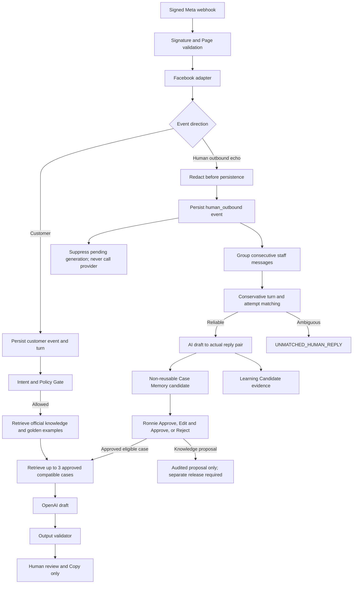

# Phase 3.6 Continuous Learning from Actual Human Replies Design

## Status

- Design requested by Ronnie on 18 August 2026.
- Implementation base: Phase 3.5 candidate `59b047dab4688cdead2ea683dd214ea7ce92ba43`.
- Production remains on the pre-Phase-3.5 release. Phase 3.5 migration/deployment is a prerequisite, not part of this design approval.
- This document does not authorize implementation, Production deployment, Meta callback changes, Website Chat, image AI, Send API, autonomous replies, fine-tuning, or automatic knowledge publication.

## Goal

Capture Ronnie's real replies from signed Meta outbound echo events without changing how Ronnie works in Meta Business Suite. Persist the sanitized outbound message in the correct conversation, safely compare it with the AI drafts for the corresponding customer turn, and create reviewable case memories and learning candidates. Only Ronnie-approved, low-risk, policy-compatible case memories may influence future drafts.

## Non-goals

- No realtime fine-tuning or model training.
- No automatic customer send or Messenger Send API.
- No automatic promotion of one reply into policy, pricing, a golden reply, or an answer-quality rule.
- No Website Chat implementation.
- No image analysis or image editing.
- No current-price, shipping-cost, ETA, capacity, order, balance, payment, tracking, or promotion lookup.
- No cross-customer conversation history in prompts.

## Architectural Choice

Use the existing channel-independent Customer Service Engine and PostgreSQL source of truth. Facebook remains the only active adapter. Phase 3.6 adds four bounded services around the existing engine:

1. **Outbound capture** verifies, classifies, sanitizes, deduplicates and persists Meta echoes as `human_outbound` conversation events.
2. **Human reply matcher** groups consecutive staff messages, matches them conservatively to a specific customer turn and one of that turn's AI attempts, or records `UNMATCHED_HUMAN_REPLY`.
3. **Case memory service** creates sanitized, non-reusable candidates and enables retrieval only after explicit admin approval and eligibility checks.
4. **Learning candidate service** aggregates repeated edit patterns for Ronnie review without modifying files, prompts or policy automatically.

The existing policy gate still runs before any case retrieval or provider call. Case memory is optional context below official knowledge and can never alter a gate decision.

## Data Flow

## Event Model and Timeline

`customer_service_conversation_events` remains the complete sent/received timeline. Add an `event_type` field:

- `customer_message`: a real inbound customer message confirmed by Meta;
- `human_outbound`: a real R&R/staff outbound message confirmed by Meta echo;
- `system_event`: a bounded internal audit marker with no customer-authored content.

`role` remains `customer | staff` for Phase 3.5 compatibility. AI drafts remain exclusively in `customer_service_ai_attempts`; they are never inserted as conversation events and never appear as sent history.

The prompt receives only chronological `customer_message` and `human_outbound` items from the current internal conversation. It never labels an AI draft as staff history.

## Facebook Outbound Echo Classification

After signature and `entry.id` Page validation, a staff echo is accepted only when:

- `message.is_echo === true`;
- `message.mid` is non-empty;
- `sender.id` equals the configured Page ID;
- `recipient.id` is non-empty and becomes the server-owned external conversation key;
- text is present, or the event is stored as a non-learning attachment/system marker;
- timestamp is valid or safely falls back to `entry.time`.

The adapter may optionally capture `message.reply_to.mid` as an HMAC hash when Meta supplies it. It is matching evidence, never a required field and never persisted raw. Browser requests cannot submit sender, recipient, Page, external conversation or echo ownership data.

The webhook hashes the recipient PSID and message ID before repository access. The repository resolves the existing conversation by `(channel, external_key_hash)`. It never accepts a client-provided internal conversation ID for echo ingestion.

## Redaction Before Persistence

Outbound text is normalized and redacted before insertion. The raw outbound body is not stored in PostgreSQL, logs, metrics, feedback, or case memory. The sanitizer masks:

- email addresses;
- phone numbers;
- bank account and payment details;
- order/tracking identifiers with high-entropy numeric/alphanumeric patterns;
- full street addresses;
- URLs with tokens or query strings;
- names when detected as direct customer addressing and not needed for meaning.

The event stores sanitized text, a SHA-256 hash of the normalized raw text for duplicate/audit comparison, and redaction reason codes. The hash is not used for retrieval. Attachment URLs and source payloads are never stored. An outbound attachment-only event becomes a safe marker such as `[Staff sent an attachment]` and is excluded from learning.

Sanitization is deterministic and fail-closed. If the sanitizer fails or detects prohibited payment/identity content it stores only `[Sensitive staff reply withheld]`, records reason codes, preserves the event boundary, and excludes the event from case memory.

## Zero-Generation Echo Invariant

An outbound echo never directly schedules a draft, image job, provider call, retry or outbound request.

To prevent a stale scheduled customer turn from generating after Ronnie already replied, echo persistence and turn suppression use the same per-conversation database advisory lock/CAS boundary as turn sealing and provider reservation:

1. persist the deduplicated `human_outbound` event;
2. mark open customer turns with `last_event_at <= outbound_received_at` as `suppressed` with reason `human_outbound_received`;
3. prevent new provider reservation for any matching turn answered before reservation;
4. mark draft-ready attempts as available for comparison but not as an unsent current recommendation;
5. allow already-started provider accounting to settle safely, but never expose its result as a new recommended reply after the outbound event.

Tests must cover the race between debounce sealing, provider reservation and echo persistence. The required observable result is zero new provider invocations after a committed outbound echo for that turn.

## Human Reply Grouping

Ronnie may send several short messages as one response. Consecutive `human_outbound` events form one reply group when all are true:

- same internal conversation;
- no intervening customer event;
- each event is within 90 seconds of the previous outbound event;
- maximum 5 events and 2,400 sanitized characters.

The group is sealed after 90 seconds or immediately when a new customer event arrives. A repository recovery claim seals overdue groups if `after()` is interrupted. CAS and unique event membership prevent duplicate groups.

## Human Reply Matching Strategy

Matching is server-side and conversation-scoped. It does not rely on the globally latest draft.

### Candidate set

For a sealed outbound group, consider customer turns only when they:

- belong to the same internal conversation;
- occurred before the first outbound event;
- occurred after the previous human-outbound group boundary;
- are within two hours of the outbound group;
- are not already conclusively matched to a different outbound group.

### Evidence order

1. **Explicit Meta reply reference, HIGH confidence:** an HMAC-hashed `reply_to.mid` maps to one customer conversation event/turn.
2. **Single eligible turn, HIGH confidence:** exactly one candidate turn exists since the previous human response.
3. **Single eligible turn with multiple drafts, HIGH turn confidence:** the turn is fixed; all completed drafts created before the outbound timestamp are compared to the actual reply.
4. **Multiple candidate turns, ambiguous:** do not infer from recency alone. Store the outbound group and mark `UNMATCHED_HUMAN_REPLY` unless an explicit reply reference identifies one turn.
5. **No candidate:** store `UNMATCHED_HUMAN_REPLY`.

No language model is used to decide conversation ownership or turn matching.

### Draft selection and edit classification

For the matched turn, compare the sanitized actual reply against every validated `draft_ready` attempt completed before the first outbound event. Select the highest deterministic similarity; recency is only a tie-breaker.

Classification:

- `accepted_unchanged`: normalized text equality or only whitespace/punctuation normalization;
- `edited_light`: similarity at least 0.80;
- `edited_significant`: similarity from 0.35 to below 0.80;
- `ai_ignored`: similarity below 0.35;
- `independent_reply`: matched turn has no eligible AI draft;
- `unmatched`: no reliable turn match.

Store the similarity score and deterministic reason codes. Thresholds are evaluation targets, not policy; TDD may tighten them before implementation approval if fixtures show poor precision.

## Database Design

Use one additive migration after `0031_reply_assistant_conversation_context`.

### Extend `customer_service_conversation_events`

Add:

- `event_type`: `customer_message | human_outbound | system_event`;
- `body_hash`: SHA-256 of normalized source text, nullable for historical rows;
- `redaction_codes`: JSONB string array;
- `reply_to_external_message_key_hash`: nullable HMAC hash;
- `learning_eligible`: boolean default false.

Backfill existing customer/staff events to `customer_message`/`human_outbound`. Existing IDs and rows remain unchanged.

### `customer_service_human_reply_matches`

One row represents one grouped actual human response:

- internal `conversation_id`;
- first/last outbound timestamps;
- `status`: `pending | matched | unmatched | excluded`;
- nullable matched `turn_id` and `ai_attempt_id`;
- sanitized `human_final_text`;
- sanitized conversation-context summary;
- match method, confidence band and integer score;
- edit classification, similarity score and edit reason codes;
- intent, risk and official policy-reference snapshot;
- exclusion codes and audit timestamps.

Database constraints require matched rows to have a turn, unmatched rows to have neither a turn nor attempt, and an attempt to belong to the matched turn's representative message.

### `customer_service_human_reply_match_events`

Join outbound conversation events to one reply match/group. Each outbound event belongs to at most one group. Composite foreign keys enforce the same conversation.

### `customer_service_case_memories`

Contains only sanitized reusable representations:

- source human-reply match;
- intent;
- normalized customer situation;
- customer-turn and context summaries;
- AI draft and Ronnie final reply, sanitized;
- edit classification and reason codes;
- optional product category;
- coarse market only (`NZ`, `AU`, `other`, `unknown`), never customer postcode/address;
- deadline context category, never an unnecessary exact private event date;
- official policy references and knowledge version;
- risk class;
- `eligibility_status`: `pending_review | approved_reusable | excluded | revoked`;
- source confidence;
- approver user ID and decision timestamps.

Only `approved_reusable` rows can be retrieved.

### `customer_service_case_retrievals`

Audit one case considered for one AI attempt:

- attempt and case IDs;
- rank;
- total score and component scores;
- threshold result;
- injected boolean;
- exclusion reason;
- retrieval latency.

It stores no customer identifier or prompt text.

### `customer_service_learning_candidates`

Aggregate repeated edit patterns:

- candidate kind: `golden_example | answer_quality_rule | knowledge_change`;
- intent and normalized proposed change;
- evidence count and distinct-case count;
- reason codes and source case-memory IDs;
- status: `pending | approved | rejected | superseded`;
- edited approved text when applicable;
- reviewer user ID and timestamps.

Approval records a reviewed proposal. Only an approved `case_memory` is immediately eligible at Case Memory priority. Golden, answer-quality and knowledge proposals do not edit repository files or Production prompts automatically; publication remains a separate reviewed release.

## Experience Is Not Policy

Hard precedence is enforced in code and prompt structure:

1. Official Policy
2. Current Realtime Data
3. Approved Knowledge
4. Approved Golden Examples
5. Approved Case Memory
6. Raw Historical Experience, audit only and never prompt-injected

The policy gate runs before case retrieval. A blocked gate returns zero case retrievals and zero provider calls. Retrieval cannot alter intent, gate result, risk or official rule IDs.

Automatically exclude from reusable memory:

- discount, compensation, refund or cancellation;
- damaged goods, misprint/reprint or consumer-rights dispute;
- chargeback/payment dispute;
- one-off shipping or delivery arrangement;
- special customer pricing or manually overridden policy;
- temporary promotion;
- HIGH RISK, `REALTIME_REQUIRED` or `UNRESOLVED` source;
- any reply with withheld sensitive text;
- any case that conflicts with the current knowledge version.

Historical currency amounts, shipping prices, ETA, availability, balances, order/payment status and promotions are stripped from the retrievable representation and recorded only as exclusion codes. The output validator remains mandatory after generation.

## Retrieval Options

### Option A: structured + PostgreSQL full-text retrieval — recommended

Use exact intent compatibility and structured filters first, then built-in PostgreSQL full-text token similarity over normalized situation and approved reply summaries. Score components are auditable: intent, product, market, risk, policy compatibility, text relevance and bounded recency. No extension, embedding call or third-party service is required.

Advantages: cheapest, deterministic, easy to test, privacy-preserving, easy to rollback, and appropriate for the first hundreds of approved cases. Limitation: weaker paraphrase recall.

### Option B: PostgreSQL pgvector + embeddings

Production PostgreSQL reports `vector` 0.8.0 available but not installed. This option requires an additive extension/migration, embedding provider calls, model/version tracking, embedding privacy review, re-embedding operations and less transparent ranking.

Advantage: better semantic recall at scale. Disadvantages: greater operational/privacy complexity and cost before enough approved cases exist to justify it.

### Option C: hybrid structured + vector

Apply mandatory structured/policy filters, then combine full-text and vector scores. This is the strongest later-stage retrieval option, but inherits Option B complexity.

### Decision

Implement Option A for Phase 3.6. Reconsider hybrid retrieval only after at least 200 approved reusable cases and an offline evaluation demonstrates that structured retrieval misses relevant paraphrases while maintaining zero leakage and policy conflict. Do not install pgvector in Phase 3.6.

## Structured Retrieval Contract

Case retrieval runs only after `DRAFT_ALLOWED` and official knowledge retrieval. Mandatory filters:

- `eligibility_status = approved_reusable`;
- exact compatible intent;
- source risk low/medium and current request risk compatible;
- no high-risk/realtime/sensitive exclusion code;
- policy references still exist and do not conflict;
- product/market compatible when those dimensions are known.

Rank by an auditable 100-point score:

- intent compatibility: required, 35 points;
- policy compatibility: required, 20 points;
- full-text relevance: up to 20 points;
- product relevance: up to 10 points;
- market relevance: up to 5 points;
- risk compatibility: 5 points;
- bounded recency: up to 5 points.

Inject at most Top 3 cases with score at least 70. If fewer pass, inject fewer or none. Case prompt text uses normalized situation and sanitized Ronnie reply only, clearly labelled as lower-priority experience. Every considered/retrieved case is audited.

## Learning Candidate Workflow

Capture and matching do not require Ronnie action. The system may create a pending learning candidate only after the same edit reason appears in at least 3 approved low-risk cases from at least 3 distinct internal conversations.

`/reply-assistant` adds one compact `Review Learning Candidates` section. Admin can:

- **Approve:** approve the reviewed proposal;
- **Edit & Approve:** save the admin-edited sanitized proposal and approve it;
- **Reject:** store a reason and prevent the same evidence set from recreating it.

Staff may view learning metrics but cannot approve knowledge-impacting candidates. Use a dedicated admin-only permission such as `review_reply_learning`; do not broaden `use_reply_assistant`.

Case-memory approval and learning-candidate approval are distinct. Approving a case enables low-priority case retrieval. Approving a golden/quality/knowledge proposal records a publication candidate only; it does not mutate files, compiled knowledge or prompts.

## Edit Reason Analysis

Use deterministic comparison first:

- required-point coverage difference;
- length and line-count difference;
- greeting added/removed;
- next-step/postcode/deposit/product-reason patterns;
- product-detail terms added;
- contextual details copied from same-conversation history;
- tone-formality markers.

Supported initial reason codes:

- `ai_too_generic`;
- `ai_too_long`;
- `missing_product_difference`;
- `missing_recommendation_reason`;
- `missing_next_step`;
- `missing_deposit_process`;
- `missing_shipping_postcode_request`;
- `tone_too_formal`;
- `unnecessary_greeting`;
- `wrong_conversational_continuation`;
- `missing_contextual_detail`;
- `independent_human_reply`.

No model-generated edit label may become policy. If a later model-assisted classifier is proposed, it requires a separate design and must remain advisory.

## Privacy and Cross-Customer Threat Model

| Threat | Control |
| --- | --- |
| Browser binds an outbound reply to another customer | Echo ingestion accepts no browser identity input; signed Meta sender/recipient mapping is server-owned. |
| Customer A history appears in Customer B context | Conversation history query requires the current message's repository-resolved conversation ID and composite same-conversation foreign keys. |
| Customer A private data appears through Case Memory | Redaction before persistence, normalized case representation, explicit approval, sensitive-pattern exclusion and prompt-boundary tests. |
| Historical special price becomes policy | Realtime/currency stripping, policy compatibility filter, lower precedence and mandatory output validation. |
| Malicious historical text instructs the model | Case text is treated as delimited example data, never instructions; only approved sanitized cases enter prompts. |
| Duplicate Meta echo creates duplicate learning | HMAC message dedupe plus unique outbound-event membership and idempotent matching. |
| Spoofed outbound direction | Meta signature, Page ID, Page sender ID and `is_echo` validation. |
| Staff reply contains bank/address/payment data | Fail-closed redaction before persistence and automatic learning exclusion. |
| Old case conflicts with new policy | Knowledge-version/policy-reference revalidation; case becomes stale/excluded before retrieval. |
| Exact customer-specific dates/postcodes leak | Store coarse market/deadline categories; remove unnecessary exact values from case representation. |

Cross-customer leakage target is exactly zero.

## Dashboard

Keep the existing compact metrics layout. Add a `Learning` subsection with:

- actual human replies captured;
- matched AI-to-human pairs;
- unmatched human replies;
- accepted unchanged;
- edited;
- AI ignored/independently written;
- reusable approved case memories;
- excluded high-risk/realtime/sensitive cases;
- cases retrieved in recent drafts;
- pending/approved/rejected learning candidates;
- top edit-reason counts.

The candidate list shows sanitized text only. No raw PSID, external conversation ID, email, phone, address, order number, payment data or attachment URL is exposed.

## Continuous Learning Summary

After each 50 newly matched replies, produce an on-demand database report of edit-reason counts and potential candidates. It does not automatically create or approve a rule, change a prompt, edit knowledge files or call OpenAI. Report generation is idempotent per 50-match checkpoint.

## Safety Invariants

- HIGH RISK, `UNRESOLVED` and `REALTIME_REQUIRED` remain blocked before case retrieval and provider invocation.
- Output validator is unchanged and mandatory.
- Case retrieval cannot alter gate decisions.
- No `META_PAGE_ACCESS_TOKEN`, Graph send endpoint, recipient send payload or automatic sending capability.
- Echo provider calls: zero.
- Automatic send: zero.
- High-risk case reuse: zero.
- Realtime-data leakage: zero.
- Cross-customer leakage: zero.
- Fine-tuning: prohibited.

## Failure Handling

- Invalid signature/Page/direction: existing non-2xx rejection; no persistence.
- Duplicate echo: 200, no duplicate event/group/match.
- Sanitizer failure: safe withheld marker, excluded from learning, 200 after durable persistence.
- Ambiguous matching: persist outbound group, `UNMATCHED_HUMAN_REPLY`, no forced pair.
- Retrieval query failure: generate using official knowledge only and record retrieval failure; never fail open to raw cases.
- Policy-version conflict: exclude the case and continue without it.
- Learning aggregation failure: preserve captured/matched data; retry idempotently.
- `after()` interruption: repository recovery claims overdue outbound groups with CAS.

## Release Boundary

Implementation requires a separate approval after review of this spec and its TDD plan. Work remains in the independent Phase 3.6 branch. Staging must use a real Test App/Test Page echo and isolated database. Production callback, feature flag, database and deployment remain unchanged until a later explicit rollout approval.
