# Phase 3.5 Conversation-Aware Messenger Context Design

## Status

- Requirements approved by Ronnie on 2026-08-18.
- Implementation baseline: `12d3f581945badaaf06f2d1fd9a047069bcbfbd6`.
- This phase does not authorise a Production deployment, Meta callback change, Website Chat, image AI, Send API, or autonomous reply.

## Goal

Treat related Facebook messages from one sender as a server-owned conversation and meaningful customer turns. Use recent customer and staff messages to interpret short follow-ups without weakening the existing policy gate, output validator, privacy controls, or human-review workflow.

## Non-goals

- No Website Chat implementation.
- No image analysis or image editing.
- No automatic or API-based customer sending.
- No live price, delivery, capacity, order, balance, or customer-data lookup.
- No change to HIGH RISK, `UNRESOLVED`, or `REALTIME_REQUIRED` decisions.
- No Production environment or callback change.

## Chosen Architecture

Add two PostgreSQL structures without changing the existing incoming-message and AI-attempt contracts:

1. `customer_service_conversation_events` stores safe text events for both `customer` and `staff`, scoped by the existing internal conversation ID. External sender and message identifiers remain HMAC hashes.
2. `customer_service_turns` groups one or more rapid customer events into a meaningful turn. It owns debounce state, acknowledgement suppression, pilot sequence, and the representative legacy message used by existing AI attempts and UI routes.

The existing `customer_service_messages` table remains the compatibility record for customer webhook events. Staff echoes are stored only as conversation events and never create an AI attempt or consume a pilot slot. This additive design avoids weakening the existing incoming-only database constraint.

## Data Flow

```mermaid
flowchart LR
  Meta["Meta Messenger event"] --> Verify["Signature and Page validation"]
  Verify --> Adapter["Facebook adapter: customer or staff role"]
  Adapter --> Persist["DB-first event persistence"]
  Persist --> Staff{"Staff echo?"}
  Staff -->|Yes| Context["Context only; no draft"]
  Staff -->|No| Turn["Open or extend customer turn"]
  Turn --> Debounce["Debounce deadline"]
  Debounce --> Claim["Repository CAS seals one turn"]
  Claim --> Ack{"Acknowledgement only?"}
  Ack -->|Yes| Suppress["No draft and no pilot slot"]
  Ack -->|No| Pilot["Allocate one pilot sequence"]
  Pilot --> History["Server-side same-conversation history"]
  History --> Resolve["Contextual intent resolution"]
  Resolve --> Gate["Existing policy gate"]
  Gate --> AI["Existing knowledge and provider path"]
  AI --> Review["Human-review draft and Copy flow"]
```



The webhook remains DB-first and returns 200 after durable persistence. Deferred work may try to seal the turn after the configured debounce window. A repository recovery method can claim due turns if the first `after()` run is interrupted. CAS and unique constraints ensure one turn, one pilot slot, and at most one automatic generation attempt.

## Channel Contract

The normalized adapter output gains a channel-independent role:

```ts
type ConversationRole = "customer" | "staff";

type NormalizedConversationEvent = Readonly<{
  channel: "facebook" | "website";
  role: ConversationRole;
  externalConversationKey: string;
  externalMessageKey: string;
  text: string | null;
  attachments: readonly NormalizedAttachment[];
  receivedAt: Date;
}>;
```

For Facebook customer messages, the conversation key is the sender PSID. For `message.is_echo`, the conversation key is the recipient PSID and the role is `staff`. Page delivery/read events remain ignored. The future Website adapter keeps the same interface but remains disabled.

## Conversation and Turn Rules

- `(channel, external_conversation_hash)` remains the unique internal conversation mapping.
- Every event is deduplicated by `(channel, external_message_hash)` before turn handling.
- A customer text event opens or extends the latest open turn for that conversation when it falls inside the configured debounce window.
- The turn body is composed in event order with newline separators and bounded by event count and character limits.
- Staff events close any open customer turn boundary and become context for later turns; they never join customer text.
- Attachments continue through the existing human-review-only path and do not restore image AI.
- Pilot sequence allocation occurs when a meaningful turn is sealed, not when each raw webhook event arrives.
- Duplicate delivery, duplicate recovery, or concurrent seal calls cannot allocate a second pilot slot or second automatic attempt.

## Context Retrieval and Intent Resolution

Before intent detection, the repository loads a bounded chronological history for the current internal conversation only. Each item includes `role` and safe text. The current turn is represented as one customer item even when it contains several webhook fragments.

A deterministic contextual resolver runs before the existing policy gate:

- It may carry forward a clearly pending slot from a recent staff question, such as location, size, date, product, or photo count.
- It may map a short answer to the prior eligible intent, for example `Australia`, `A1`, `next Saturday`, or `around 5 photos`.
- It may resolve pronouns such as `this one` only as a request for human-readable clarification; it may not infer an image, product, price, or commitment that is absent from text context.
- A clearly unrelated new question starts a new intent and is not forced into the previous topic.
- Current-message HIGH RISK and realtime expressions always take precedence over inherited context.

The provider prompt receives role-labelled, bounded history. Policy gate input uses the resolved current turn plus only the minimum safe context needed to identify intent. Historical text can clarify an intent but cannot turn an unresolved or realtime rule into a confirmed fact.

## Acknowledgement Suppression

Short acknowledgements such as `thanks`, `thank you`, `okay`, `ok`, and `got it` are suppressed when the recent exchange is complete and no staff question is awaiting an answer. `Yes` is suppressed only when no recent staff question or unresolved information request makes it meaningful. Suppression happens before pilot allocation and before any provider call.

Suppressed turns remain auditable in the database with a reason code. They do not appear as sendable drafts and do not count toward the 100-turn pilot.

## Privacy and Isolation

- Raw Facebook sender, recipient, and message IDs are HMAC-hashed before persistence.
- Conversation history is loaded only by server repository methods using the current message/turn's internal conversation ID.
- Client routes never accept an external conversation identifier or a caller-supplied conversation ID.
- Queue DTOs expose only internal message/attempt IDs and safe message text already required for review.
- Repository tests prove one conversation cannot retrieve events, turns, or staff replies from another.
- Context, logs, feedback, and metrics contain no raw PSID.

## Safety Invariants

- Policy gate runs before every model invocation.
- HIGH RISK, `UNRESOLVED`, and `REALTIME_REQUIRED` continue to produce zero provider calls.
- Context inheritance cannot override a current-message safety classification.
- The output validator remains mandatory and unchanged unless an independent regression demonstrates a defect.
- No Page access token, Send API client, send route, or automatic send capability is introduced.
- Image-bearing messages remain `NEEDS_HUMAN_REVIEW` with zero image-provider calls.

## Metrics

`totalIncomingEligible` becomes the count of sealed meaningful customer turns assigned to a pilot, not raw webhook events. Add metrics for raw customer events, staff context events, turns sealed, fragments aggregated, acknowledgements suppressed, and debounce recovery. Existing draft, feedback, policy, cost, and latency metrics remain attempt-based.

## Evaluation

Create a deterministic multi-turn fixture with separate hashed conversation labels covering:

- location, size, and date follow-ups;
- quote information collection;
- product clarification;
- acknowledgement suppression and context-required `yes`;
- fragmented rapid messages;
- unrelated new questions after prior context;
- HIGH RISK and realtime follow-ups;
- cross-customer isolation.

Report context retrieval accuracy, short-reply interpretation accuracy, unnecessary-draft rate, cross-customer leakage, policy bypass, direct/assisted acceptance, latency, and cost. Acceptance uses Ronnie-approved expected replies or required-point grading; deterministic mock evaluation is not represented as real OpenAI quality evidence.

## Rollout Boundary

Phase 3.5 ends with a reviewable candidate and local/isolated-database evidence. It does not deploy or migrate Production. Staging and Production rollout require separate approval and environment validation.
