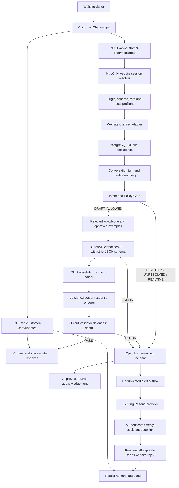

# Phase 3.7 Website Customer Assistant Design

## Status

- The Website-only structured-output amendment is approved for implementation. Production remains unauthorized.
- Baseline audit: `docs/audits/2026-08-21-website-customer-assistant-architecture-audit.md`.
- Facebook remains human-review only with no `META_PAGE_ACCESS_TOKEN`, Messenger Send API, or automatic sending.
- Website image input, Website Chat order actions, realtime tools, fine-tuning, and autonomous business actions are out of scope.

## Goal

Add a small public website chat that reuses the existing channel-independent Customer Service Engine. Low-risk, policy-confirmed, validator-approved answers may be displayed directly in the website chat. Anything HIGH RISK, UNRESOLVED, REALTIME_REQUIRED, provider-failed, or validator-blocked enters human review and creates exactly one durable email alert for that review incident.

## Architecture



The website publication layer is separate from generation. An AI attempt is not customer-visible merely because it is `draft_ready`. A Website `draft_ready` attempt persists its canonical validated decision and renderer-template version. Publication requires the same transaction to revalidate that decision, require the current matching template version, re-render the exact text, and verify channel `website`, gate `DRAFT_ALLOWED`, validator PASS, live session ownership, non-terminal turn, and no intervening human response.

## Channel adapter

`WebsiteChannelPayload` contains only server-resolved session ownership and validated public input:

```ts
type WebsiteChannelPayload = Readonly<{
  sessionKeyHash: string;
  clientMessageKeyHash: string;
  text: string;
  productContext: SafeProductContext | null;
  receivedAt: Date;
}>;
```

The adapter emits the existing canonical `NormalizedIncomingMessage` with channel `website`, customer role, customer message event, no attachments, and server-derived external conversation/message keys. Browser data never supplies an internal conversation ID, external key hash, role, risk result, policy status, or channel.

Facebook remains unchanged. Both adapters call the same repository and engine interfaces.

## Website session design

### Cookie

- Name: `__Host-rnr_customer_chat` in HTTPS environments; local development uses `rnr_customer_chat` because `__Host-` requires Secure HTTPS.
- Value: 32 random bytes encoded base64url.
- Attributes: `HttpOnly`, `Secure` in Preview/Production, `SameSite=Lax`, `Path=/`, no Domain, high priority.
- Lifetime: seven-day absolute expiry. No fingerprinting and no extension beyond seven days.
- The raw token exists only in the cookie and current request. PostgreSQL stores an HMAC-SHA-256 token hash using `CUSTOMER_CHAT_SESSION_SECRET`.

### Ownership

`customer_service_web_sessions` maps one token hash to one website conversation. Public routes resolve the session server-side. A missing/expired token creates a new session only on a valid message POST. GET never creates sessions.

The browser receives no raw database ID, conversation ID, external identity hash, customer ID, sender ID, or token other than the HttpOnly cookie. Public event keys are per-session HMAC aliases used only for rendering/deduplication.

### Expiry and retention

- Session cookie and session row: seven days.
- Public conversation messages: 90 days by default, then deleted or anonymized by a reviewed retention job unless linked to a real order, dispute, or approved legal retention reason.
- Rate-limit buckets: at most 24 hours.
- Alert audit metadata follows the customer-service retention period; deep-link token hashes expire after seven days.
- The exact 90-day conversation retention requires Ronnie privacy sign-off before Production.

## Public API design

### `POST /api/customer-chat/messages`

Request:

```json
{
  "clientMessageKey": "browser-generated-random-key",
  "message": "What details do you need for a quote?",
  "pageContext": { "pathname": "/products/roll-up-banner" }
}
```

Rules:

- Same-origin JSON only via the existing trusted-mutation checks.
- Maximum body 4 KiB; message 1–2,000 Unicode characters; client key 22–64 base64url characters.
- Product context is optional and validated server-side against public route patterns and the current product registry.
- The client key is HMACed with session ownership before persistence for retry idempotency.
- Message persistence happens before processing. The response is `202` with `{ "status": "accepted" }` and, for a new session, the HttpOnly cookie.
- `after()` may process immediately, but the existing durable recovery worker is authoritative if `after()` is interrupted.

### `GET /api/customer-chat/updates?cursor=<opaque>`

- Resolves only the HttpOnly session.
- Returns only that session's customer messages, committed website AI responses, human website replies, and bounded state labels.
- Cursor is signed, versioned, session-bound, and encodes `(createdAt, stable internal ordering key)` without exposing either value directly.
- Response event keys are session-scoped HMAC aliases.
- `Cache-Control: no-store`.
- Polling never invokes intent detection, OpenAI, learning, or recovery.

Response:

```json
{
  "cursor": "opaque-cursor",
  "hasMore": false,
  "events": [
    { "eventKey": "opaque", "role": "assistant", "text": "...", "createdAt": "..." }
  ],
  "state": "ready"
}
```

Public errors use generic codes and never expose provider, policy source, internal IDs, stack traces, tokens, database errors, or alert state.

## Policy and response flow

### DRAFT_ALLOWED

1. Load same-session recent context.
2. Detect intent.
3. Run Policy Gate.
4. Retrieve approved Case Memory only as a bounded action-selection signal; literal memory/customer reply text is not placed in the Website decision prompt.
5. Call the reviewed low-cost provider under website and global cost reservations with a strict JSON schema.
6. Parse an exact-key decision containing only allowlisted actions, intents, product types, missing/follow-up fields, fact enums, and a human-review reason. No customer-facing string field exists.
7. Verify the decision against the server Policy Gate result, detected intent, product context, and existing acknowledgement rules.
8. Render only version-controlled server-owned fragments. Model and customer strings never enter the renderer.
9. Run the existing Website Output Validator as defense-in-depth over the rendered text.
10. Commit one customer-visible website assistant response with a unique AI-attempt reference. The publication CAS revalidates the stored canonical decision and template version, re-renders it, and rejects missing proof, invalid composition, version drift, or any exact-text mismatch.

### Structured Website decisions

The allowed actions are `ANSWER_SAFE`, `ASK_FOR_INFORMATION`, `NO_REPLY_NEEDED`, `HUMAN_REVIEW_REQUIRED`, `REALTIME_REQUIRED`, and `SYSTEM_FALLBACK`. Unknown keys, unknown enum values, duplicate slots, action/intent mismatches, product mismatches, unsupported facts, and arbitrary prose fail closed. Schema/provider failures use the existing fixed provider fallback, human-review incident, and deduplicated alert path.

`HIGH_RISK`, `UNRESOLVED`, and supported or unsupported realtime requests remain blocked before provider invocation. A model decision cannot downgrade those states, supply a current value, perform an action, or create a link. `NO_REPLY_NEEDED` completes without a public response only when the existing acknowledgement classifier already permits suppression.

### REALTIME_REQUIRED

The provider is not called. The system opens human review and may display this approved neutral acknowledgement:

> I can help collect the details for our team. Please send the product, size, number of people/photos, required date, and your suburb or postcode if delivery is needed. We’ll review the current details and get back to you.

It must not state a current price, shipping fee, delivery ETA, production capacity, promotion, balance, payment status, tracking, or order status.

### HIGH RISK or UNRESOLVED

The provider is not called. The system opens human review and displays:

> Thanks for letting us know. Our team needs to review this before replying, and we’ll get back to you as soon as we can.

This is not a promise of resolution, refund, compensation, timing, or outcome.

### Provider error or Output Validator block

Persist the failure, open human review, and display:

> Thanks for your message. Our team will review it and reply here as soon as we can.

No failed or rejected model text is returned to the browser.

The three neutral acknowledgements are part of the design approval. Implementation must store them in governed knowledge or a reviewed response-policy module, not scatter hard-coded copies across routes.

## Website sent-history model

Add `customer_service_website_assistant_messages` rather than weakening the existing conversation-event role checks.

Each row records:

- website conversation and turn;
- optional validated AI attempt;
- kind: `validated_ai | policy_acknowledgement | provider_fallback`;
- customer-visible body;
- immutable publication timestamp;
- policy/gate snapshot and knowledge version;
- public update ordering fields.

AI attempts remain internal. Only this committed row means the response was displayed. Website context merges customer events, real staff `human_outbound` events, and committed website assistant messages chronologically. Facebook context behavior remains unchanged.

Website assistant messages are excluded from human-reply learning evidence, Golden Replies, Learning Candidates, and Case Memory unless Ronnie later creates and approves a separate human-reviewed learning artifact.

## Knowledge and experience precedence

The existing precedence remains load-bearing for both channels:

1. Official Policy
2. Current Realtime Data
3. Approved Knowledge
4. Golden Replies
5. Approved Case Memory action-selection signal only
6. Historical Experience

Website context and public product context cannot override this order. An approved historical answer with an old price, shipping fee, ETA, capacity, promotion, balance, tracking result, or order state remains unusable as current data.

## Human-review incident and manual website reply

`customer_service_human_reviews` represents one open incident, not one raw message.

- Transition from no open review to open review increments the conversation review generation and creates one review row.
- Additional customer messages while the review is open attach to the same incident and do not create another email.
- An authorized staff member can write and explicitly send a website reply from `/reply-assistant`.
- The server resolves the conversation from an authorized queue item, persists a real `human_outbound`, closes the incident with CAS, and publishes a website update.
- Sending a human website reply invokes neither OpenAI nor Messenger.
- If the issue later re-enters human review after resolution, a new generation creates one new alert.

This manual website reply is the only new send action. It is scoped to the website session and requires an explicit admin/staff button. It does not create a generic outbound API and cannot address Facebook.

## Email notification design

Reuse `createResendEmailProvider()` with server-only `RESEND_API_KEY` and `EMAIL_FROM`. Add `REPLY_ASSISTANT_ALERT_TO` as a server-only recipient. Do not reuse a customer address.

`customer_service_review_alert_outbox` is inserted in the same transaction that opens the human-review incident. A unique constraint on `human_review_id` gives exactly one email per incident.

Delivery uses:

- best-effort `after()` for speed;
- a secured one-minute Cron worker for durability;
- lease/CAS claims;
- the existing Resend idempotency-key capability;
- bounded retry delays of 1, 5, 30, 120, and 720 minutes.

Email content includes only:

- channel `Website`;
- review reason category;
- a redacted summary capped at 160 characters;
- received time;
- an authenticated deep link.

The link is `/reply-assistant?review=<random-token>`. PostgreSQL stores only its SHA-256 hash and seven-day expiry. The token grants no authorization; Better Auth and `use_reply_assistant` remain mandatory. The page resolves the token server-side and never returns the token, conversation ID, or customer session identity to unrelated clients.

Email failure is fail-soft: chat persistence, the neutral acknowledgement, admin queue visibility, and later human response continue. The outbox remains retryable and the dashboard shows alert failure.

## Product page context

The client may submit only the current pathname. The server derives a `SafeProductContext` from route + current product registry:

```ts
type SafeProductContext = Readonly<{
  market: "NZ" | "AU";
  productKey: string;
  productTitle: string;
  category: "canvas" | "banners";
  pageKind: "product" | "configure";
}>;
```

Do not include cart contents, customer configuration, query strings, current price, shipping, availability, urgent capacity, customer ID, order ID, or payment state. The context is a hint for intent and retrieval, never authority.

## Realtime tool interfaces

Phase 3.7 defines only disabled interfaces:

```ts
interface RealtimeBusinessDataProvider {
  quote(input: unknown): Promise<never>;
  shipping(input: unknown): Promise<never>;
  orderStatus(input: unknown): Promise<never>;
}
```

No implementation, route, credentials, or model tool call is added. The Policy Gate continues to return REALTIME_REQUIRED.

## Rate limiting and cost controls

### Request limits

- Per session: 5 message POSTs per minute, 30 per hour, 100 per seven-day session.
- Concurrent generation: one running customer turn per website session.
- Per short-lived network bucket: 10 POSTs per minute and 60 per hour. The bucket key is a daily HMAC of the trusted Vercel client-IP header; no raw IP is stored and rows expire within 24 hours.
- Global payload: 4 KiB request and 2,000-character message.
- On limit: `429`, no provider call, no alert storm, and a short retry message.

### Cost limits

- Preserve the existing global Customer Service budget.
- Add website scopes `daily:website:YYYY-MM-DD` and `total:website` in the existing budget table.
- Initial Preview defaults: warning USD 0.10/day, hard stop USD 0.25/day, pilot total hard stop USD 2.00.
- Production values require Ronnie approval after Staging cost evidence.
- Budget exhaustion opens one human-review incident and makes zero further provider calls.

At the observed USD 0.000181 average call cost, USD 0.25 is roughly 1,380 average calls. The hard stop is still necessary because token length and pricing can change.

## Threat model summary

Detailed threats are in `docs/security/2026-08-21-website-customer-assistant-threat-model.md`. Load-bearing controls are:

- server-only opaque session ownership;
- same-origin JSON mutations;
- bounded payloads and rate/cost reservations;
- Policy Gate before provider;
- strict Website decision schema and intent/policy compatibility before rendering;
- versioned server-owned Website fragments, with the canonical decision and template version independently revalidated and exactly re-rendered at publication;
- Output Validator over rendered Website text as defense-in-depth;
- no arbitrary conversation selector in public APIs;
- no raw IP, session token, internal ID, or secret in logs/browser/model;
- prompt text treated as untrusted data;
- one-session-only queries and session-bound cursors;
- no image, file, URL-fetch, order, payment, refund, discount, or Messenger-send capability.

## Privacy and OpenAI data handling

- The provider continues to send `store: false` and bounded text-only inputs.
- The OpenAI organization must remain opted out of voluntary data sharing; this is verified manually in Staging.
- API data is not used for training by default unless the organization opts in, but the privacy notice must disclose OpenAI as an overseas service provider and must not promise zero retention.
- Before Production, `/privacy` must explain website chat, AI-assisted low-risk replies, human review, session cookie, purposes, provider sharing, retention, and how to contact the Privacy Officer.
- Customer chat data is not advertising, profiling, or automatic policy-training data.

## UI and UX

### Public widget

- Bottom-right 48px icon button with accessible name `Chat with R&R Gallery`.
- Closed by default and remembered only for the current page lifecycle.
- Panel width `min(380px, calc(100vw - 24px))`, max height `min(620px, calc(100dvh - 96px))`.
- Mobile uses 12px viewport margins and safe-area bottom inset.
- Header, scrollable transcript, status region, multiline input, and icon send button.
- Enter sends; Shift+Enter inserts a line break.
- Focus moves into the dialog on open and returns to the launcher on close; Escape closes.
- `aria-live=polite` announces new responses without rereading history.
- Never mounts on `/admin`, `/reply-assistant`, `/forms`, `/order-system`, `/checkout`, payment return routes, account security pages, order/proof pages, or privacy pages.
- On cart and product pages it remains collapsed by default and must not overlap fixed checkout actions, cookie controls, navigation, or mobile safe areas.

### Admin inbox

- Add a `Facebook` or `Website` badge to every conversation card and timeline.
- Website review cards show alert status and a manual website reply editor.
- Existing Facebook Copy/manual-Meta workflow is unchanged.
- Live polling updates both channels without OpenAI calls and preserves unsaved local edits.

## Metrics

Add channel-filterable metrics:

- website sessions and meaningful turns;
- validated AI responses displayed;
- human reviews opened/resolved;
- alert sent/failed/deduped;
- website human replies;
- rate/budget blocks;
- provider calls, tokens, cost, latency;
- direct automated resolution rate;
- human escalation rate;
- public update latency;
- cross-session isolation violations;
- automatic business actions, fixed at zero.

## Feature flags and environment

Server-only:

- `WEBSITE_CUSTOMER_ASSISTANT_ENABLED`
- `CUSTOMER_CHAT_SESSION_SECRET`
- `CUSTOMER_CHAT_ABUSE_HASH_SECRET`
- `REPLY_ASSISTANT_ALERT_TO`
- `WEBSITE_CHAT_DAILY_WARNING_USD`
- `WEBSITE_CHAT_DAILY_HARD_STOP_USD`
- `WEBSITE_CHAT_TOTAL_HARD_STOP_USD`

Reuse server-only `OPENAI_API_KEY`, `AI_PROVIDER`, `OPENAI_MODEL`, `RESEND_API_KEY`, `EMAIL_FROM`, `CRON_SECRET`, and database variables. No secret may use `NEXT_PUBLIC_`.

## Proposed file structure

```text
src/components/customer-chat/
  customer-chat.tsx
  customer-chat.module.css
  customer-chat.test.tsx
src/app/api/customer-chat/messages/
  route.ts
  route-handler.ts
  route.test.ts
src/app/api/customer-chat/updates/
  route.ts
  route-handler.ts
  route.test.ts
src/app/api/reply-assistant/messages/[messageId]/website-reply/
  route.ts
  route-handler.ts
  route.test.ts
src/app/api/internal/reply-assistant/review-alerts/
  route.ts
  route-handler.ts
  route-handler.test.ts
src/server/customer-service/website/
  session.ts
  public-api.ts
  product-context.ts
  model-input-sanitizer.ts
  rate-limit.ts
  publication.ts
  human-review.ts
  review-alert-service.ts
  review-alert-runtime.ts
  public-updates.ts
src/server/customer-service/adapters/website.ts
src/server/customer-service/repositories/customer-service-repository.ts
src/server/customer-service/repositories/drizzle-customer-service-repository.ts
src/server/db/schema/customer-service.ts
drizzle/0038_website_customer_assistant.sql
src/server/customer-service/fixtures/website-conversation-evaluation-cases.jsonl
```

Existing `site-chrome.tsx`, Reply Assistant DTO/UI, config, metrics, privacy page, `vercel.json`, and scans receive narrow modifications during implementation.

`0038` is the next free migration number on the audited `7847392` baseline. If stacking onto the then-current combined release introduces a migration with that number, implementation must regenerate the next additive journal entry rather than overwrite or reorder an existing migration.

## Production boundary

Implementation occurs in an independent worktree and deploys only to Preview. Production feature flag stays absent/false. Production Meta callback and Facebook behavior are untouched. Production rollout requires separate approval after all Staging gates, privacy sign-off, OpenAI data-sharing verification, email delivery proof, real public abuse tests, and Payment Requests regression.
