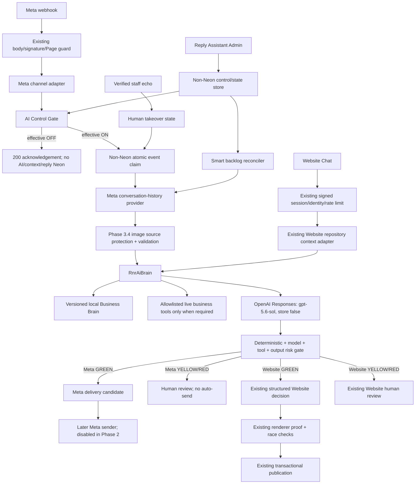

# R&R AI Reply Assistant Phase 2 Design

**Date:** 2026-09-04

**Status:** Design only; not implemented

**Source of truth:** `docs/superpowers/specs/2026-09-04-rnr-ai-reply-assistant-audit.md`

**Audited code baseline:** `origin/main` at `081fc825b5e3574c85ef674082bce41ff2f8e1bf`

## 1. Goal and non-goals

Build one server-only R&R AI Brain for Meta and Website Chat that targets `gpt-5.6-sol` response quality, uses the versioned R&R Business Brain, considers the complete available conversation and validated customer images, and applies explicit `GREEN / YELLOW / RED` decisions. Ordinary Meta replies must not require Neon. Website Chat must retain its current session, identity, rate-limit, structured-decision, renderer-proof, human-review and transactional-publication boundaries.

This design does not:

- change Production behavior or deploy anything;
- create or run a database migration;
- enable Meta auto-send;
- change prices, payment/order logic, shipping rules or business policy;
- infer Production environment values, Meta permissions or a non-Neon state service that the Phase 1 audit did not verify;
- turn historical examples into current facts.

## 2. Evidence-constrained starting point

The design starts from these Phase 1 facts:

- `src/app/api/meta/webhook/route-handler.ts` currently constructs `createCustomerServiceRuntime()` before routing Meta work.
- `src/server/customer-service/meta/webhook-handler.ts` verifies the 256 KiB limit, HMAC signature and Page ID, then writes every normalized message into the Drizzle repository.
- `src/server/customer-service/adapters/facebook.ts` supports `object === "page"`, not a distinct Instagram webhook object.
- `CustomerServiceEngine.generateDraft()` in `src/server/customer-service/engine.ts` reads at most six context items from Neon and uses Neon for attempt/budget/turn state.
- `src/server/customer-service/runtime.ts` unconditionally constructs the Drizzle repository and uses `product_registry_current` for qualifying price questions.
- `OpenAIResponsesProvider` defaults to `gpt-5.6-luna`, `reasoning:none`, text-only input and `store:false`.
- Meta output is draft-only; no Messenger Send API client exists.
- Website Chat shares the current engine and repository but adds signed session identity, rate limits, a strict structured decision, server rendering/proof, race checks and transactional publication.
- Meta customer images are currently reduced to hashed metadata and a terminal human-review result. The repository contains safe but unwired URL protection, SSRF/DNS pinning, bounded download, validation, private storage and vision components.
- Existing control is an environment flag plus a Neon-backed pilot. `OFF` currently returns `503` from the Meta webhook.

No proposed component may erase or reinterpret those facts.

## 3. Approaches considered

### A. Extend `CustomerServiceEngine` in place

This would be the smallest diff, but it would preserve the mandatory Neon ingress, six-message limit, pilot/lease/attempt writes and shared Meta/Website orchestration. It cannot satisfy ordinary Meta no-Neon operation or safe `OFF` semantics. Rejected.

### B. Shared pure AI Brain with channel-specific orchestration — selected

Create a database-agnostic `RnrAiBrain` and keep Meta and Website ingestion/publication separate. Meta obtains live thread context from Meta and uses a small non-Neon operational store for control, locks, dedupe, takeover and backlog checkpoints. Website continues to use its existing Neon-backed session/publication system but delegates reasoning to the shared brain behind a separate rollout flag. This meets the goals while preserving current Website safeguards.

### C. Provider-hosted conversation threads

Persist conversation state at the model provider and send only new turns. This conflicts with the current `store:false` privacy posture, complicates deletion and channel isolation, and makes model-provider state the source of truth. Rejected.

## 4. Target architecture



## 5. Exact architectural cut points

### 5.1 Split runtime construction

`src/server/customer-service/runtime.ts:createCustomerServiceRuntime()` currently creates the database before any channel decision. Replace its single responsibility over time with:

- `createWebsiteCustomerServiceRuntime()` retaining the current repository, Website review alerts, Website publication and existing limits;
- `createMetaReplyRuntime()` building only the Meta guard, non-Neon runtime state, Meta context provider, image resolver, shared brain and disabled sender boundary;
- `createLegacyCustomerServiceRuntime()` temporarily preserving the current implementation for rollback and shadow comparison.

The missing/invalid rollout mode must select legacy behavior. It must never select shared auto-send.

### 5.2 Separate webhook acceptance from AI enablement

In `src/server/customer-service/meta/webhook-handler.ts`, keep `readWebhookBody`, `verifyMetaSignature`, Page ownership validation and normalization before the AI gate. Remove the semantic coupling between webhook availability and `REPLY_ASSISTANT_ENABLED`:

- webhook transport enabled + valid request: return `200` even when AI is OFF;
- AI OFF: do not build conversation context, call OpenAI, call a business tool, create reply-specific Neon rows or schedule AI recovery;
- staff echo: update non-Neon takeover/delivery reconciliation only when that operational store is available; failure remains fail-closed for AI but does not make the signed webhook fail;
- invalid signature, wrong Page or oversized body retain their current failure responses.

### 5.3 Extract a shared reasoning contract

Add a pure `RnrAiBrain.generate(request)` boundary. It accepts already-authorized, sanitized channel input and returns a structured decision. It does not import Drizzle, `getDatabase`, Meta Graph clients, Website sessions or public response writers.

```ts
type RnrAiRequest = Readonly<{
  channel: "meta" | "website";
  market: "NZ" | "AU" | "UNKNOWN";
  conversation: readonly ConversationTurn[];
  attachments: readonly VerifiedImageInput[];
  businessBrain: CompiledBusinessBrain;
  toolContext: Readonly<{ conversationKeyHash: string; customerReference?: string }>;
}>;

type RnrAiDecision = Readonly<{
  risk: "GREEN" | "YELLOW" | "RED";
  intent: string;
  replyText: string | null;
  reasons: readonly string[];
  claims: readonly SupportedClaim[];
  toolEvidence: readonly ToolEvidence[];
  nextAction: "AUTO_REPLY_ELIGIBLE" | "HUMAN_REVIEW" | "NO_REPLY";
}>;
```

The result is not permission to send. Channel policy decides whether and how it may be published.

### 5.4 Keep channel publication adapters distinct

- Meta adapter: normalized Meta event → Meta context/history → shared brain → Meta risk policy → future Meta delivery candidate.
- Website adapter: current Website message/session/product context → current database context → shared brain → existing `WebsiteDecision` mapping → existing renderer/proof → `publishWebsiteValidatedAi()`.

The shared brain may decide content and risk. It may not bypass Website identity, session expiry, rate limiting, newer-turn/human-race checks or renderer proof.

## 6. Shared AI Brain boundaries

The shared brain owns:

- context interpretation across all supplied turns;
- intent, market, product and missing-information reasoning;
- Business Brain retrieval and source precedence;
- allowlisted tool planning and incorporation of tool evidence;
- multimodal reasoning over validated images;
- response drafting in the R&R voice;
- structured risk recommendation and supported-claim output.

The shared brain does not own:

- webhook authentication or Meta Page/Instagram identity;
- Website session/visitor identity;
- schedule/control evaluation;
- conversation leases, dedupe or human takeover;
- database credentials;
- Meta sending or Website publication;
- business data mutations;
- deciding that a failed live lookup is true.

## 7. Channel adapter boundaries

### 7.1 Meta

`MetaReplyOrchestrator.handle(normalizedEvent)` performs, in order:

1. evaluate effective AI control;
2. ignore non-customer events except verified staff echoes used for takeover/reconciliation;
3. atomically claim the external message key in the non-Neon runtime store;
4. reject a duplicate, active takeover or already-answered conversation;
5. fetch the complete available thread from Meta;
6. merge consecutive customer fragments into the current request;
7. resolve and validate attachments;
8. call `RnrAiBrain`;
9. re-read effective control, takeover state and latest Meta thread state;
10. produce a review item or a disabled delivery candidate.

For YELLOW/RED review, store only an application-encrypted review draft and reason in the non-Neon runtime store with a 48-hour TTL. The Admin API decrypts it server-side after `use_reply_assistant` authorization; customer content never appears in Redis plaintext or browser list payloads. If review encryption/storage fails, activate takeover and require staff to handle the conversation directly in Meta rather than sending anything.

Facebook Page and Instagram webhook payloads require separate normalizers that return one common `MetaConversationEvent`. Instagram support is not claimed until its real payload fixtures and account permissions pass tests.

### 7.2 Website Chat

`WebsiteBrainAdapter` accepts only the already-validated input produced after the current trusted-origin, bounded-body, signed-session, authoritative-identity and rate-limit checks in `src/app/api/customer-chat/messages/route-handler.ts`. It loads the complete Website session transcript through a repository method, calls the shared brain, maps the result to the existing `WebsiteDecision`, and preserves the current transactional publication flow.

Website Chat remains dependent on Neon for its product feature: session records, rate limits, message history, review state and safe publication. The shared reasoning engine itself remains Neon-free.

## 8. Business Brain runtime strategy

Create a human-reviewable, versioned JSON source at `src/server/rnr-ai/business-brain/rnr-business-brain.v0.5.1.json`. A strict compiler validates:

- exact semantic version and effective date;
- NZ/AU market separation;
- canonical products, sizes, prices and GST representation;
- shipping statements and fields that require a live lookup;
- allowed claims and forbidden claims;
- GREEN/YELLOW/RED rules;
- items marked `REVIEW`, which can never support an autonomous factual claim;
- R&R voice and reply-quality rules;
- source IDs for every machine-usable fact.

The compiler writes `src/server/rnr-ai/business-brain/compiled-business-brain.json` with a source SHA-256 and deterministic ordering. `business-brain:check` must fail when the source and compiled artifact differ. Runtime loads the compiled local artifact synchronously; it performs no Neon read and no remote knowledge fetch.

Knowledge precedence is fixed:

1. canonical market price/rule in the compiled Business Brain;
2. successful allowlisted live business-tool result;
3. other confirmed Business Brain rule;
4. current conversation facts;
5. approved examples for tone/reasoning only;
6. historical orders/quotes as non-authoritative reference only.

The existing `compiled-knowledge.json` remains unchanged during initial development and legacy rollback. It is retired only after parity tests prove that the Business Brain covers every currently confirmed safe rule.

## 9. Full conversation context

“Full context” means every available turn in the active conversation is considered; it does not mean sending an unbounded transcript to the model.

### Meta context source

Use a server-only Meta Graph history provider keyed by the verified Page/Instagram conversation identity. Fetch pages until the conversation start, Meta retention boundary or a hard safety ceiling is reached. Never use Neon history for the ordinary Meta path.

### Website context source

Add a repository read that returns the complete active Website chat transcript under the already-authorized session/identity. This is channel persistence, not a dependency of `RnrAiBrain`.

### Assembly

`assembleConversationContext()`:

- sorts by provider timestamp plus stable event key;
- removes exact duplicates;
- preserves role and channel provenance;
- merges adjacent customer fragments only for the current unanswered request;
- sanitizes Website text using the existing sanitizer;
- includes the latest turns verbatim;
- applies a deterministic fact extractor to older turns only when the total exceeds the model budget;
- never uses an LLM-generated summary as the sole source of a price, payment, deadline or policy fact;
- reports truncation/compaction metadata to the risk gate.

If context is incomplete for a material question, risk cannot be GREEN.

## 10. Image-input strategy

Reuse the existing Phase 3.4 safety components rather than the current terminal image-job wiring:

- `attachment-source-protector.ts`: AES-256-GCM source-reference protection;
- `facebook-source-reader.ts`: HTTPS allowlist, DNS pinning, redirect revalidation and private-address denial;
- `image-validation.ts`: real MIME, byte, dimensions and pixel checks;
- `attachments/limits.ts`: maximum 5 images, 4 MiB each, 12 MiB total, 20M pixels, 8192 px side, two redirects and existing timeouts;
- `openai-image-analysis.ts` safety principles: `store:false`, strict schema, no identity/age/ethnicity/health/emotion inference.

For the new Meta path, encrypt the short-lived source reference and store it only in the non-Neon operational store with a maximum 15-minute TTL. The worker downloads and validates each image, holds bytes only in memory, passes verified JPEG/PNG/WebP bytes to Sol, then drops the bytes. No public URL is created and no customer image is written to Neon.

On download, validation, expiry or provider failure, the result becomes YELLOW/RED human review; the system does not answer generically while ignoring an image. Website Chat continues with `attachments:[]` until a separately approved Website upload design exists.

## 11. AI Control Gate

### Storage and fail-closed boundary

The dynamic control and operational state cannot live only in Neon because it must be checked before any Reply-Assistant Neon work. Use a `ReplyRuntimeStore` interface requiring atomic create/compare-and-set, TTL, hash and sorted-set operations. The recommended Production adapter is a dedicated Redis-compatible managed store; the audit found no existing Redis/KV dependency, so provisioning and cost require owner approval before implementation reaches Production.

No environment flag may silently enable AI. Proposed fail-closed flags:

- `RNR_AI_MASTER_ENABLED=true` is required for any model call;
- `RNR_AI_ENGINE_MODE=legacy|shadow|shared_draft|shared_active`, with missing/invalid → `legacy`;
- `RNR_META_AUTO_SEND_ENABLED=true` is separately required by the future sender, with missing/invalid → false;
- `RNR_WEBSITE_SHARED_BRAIN_ENABLED=true` separately opts Website into shared reasoning, with missing/invalid → false.
- `RNR_AI_REVIEW_ENCRYPTION_KEY` is a distinct server-only AES-256-GCM key; missing/invalid means review payload persistence fails closed to takeover/no-send.

### Effective state order

1. master kill switch false/missing → OFF;
2. runtime store unavailable/invalid → OFF;
3. active manual override → its forced state;
4. mode `OFF` → OFF;
5. mode `ON` → ON;
6. mode `SCHEDULE` → evaluate the versioned weekly schedule in `Pacific/Auckland`;
7. any parsing/timezone ambiguity → OFF.

The evaluator uses `Intl.DateTimeFormat` with the fixed IANA timezone and is tested across NZST/NZDT transitions, midnight and overlapping periods.

## 12. ON / OFF / SCHEDULE and Manual Override

### ON

- new eligible customer messages may enter context/brain processing;
- human-takeover and risk gates still apply;
- Meta sending remains impossible unless the separate later auto-send flag and sender gate are also enabled.

### OFF

- signed webhooks still receive normal `200` acknowledgement;
- zero OpenAI calls;
- zero conversation-history fetches for AI;
- zero reply generation;
- zero Reply-Assistant-specific Neon reads/writes;
- no backlog or sender claim;
- staff/user messages remain in Meta itself and Website Chat continues according to its separately enabled existing product settings.

### SCHEDULE

- weekly Auckland-local periods define automatic ON windows;
- UI shows configured mode, effective state, timezone, current override, and next transition;
- DST changes are computed from `Pacific/Auckland`, not fixed UTC offsets;
- OFF→ON creates one smart-backlog reconciliation run.

### Manual Override

- permitted values: `FORCE_ON`, `FORCE_OFF`, `CLEAR`;
- requires `use_reply_assistant` permission, trusted-origin mutation protection and an explicit expiry for FORCE actions;
- cannot bypass the master kill switch, human takeover or risk gate;
- every change records actor ID, timestamp, prior/effective state and expiry without storing customer content;
- repeated identical requests are idempotent.

## 13. Human Takeover

Human takeover is state outside the model and applies per Meta conversation.

It becomes active when:

- a verified `is_echo` staff message is received;
- an authorized operator clicks “Take over”; or
- an uncertain-send, YELLOW or RED result requires human handling.

While active, no generation, backlog processing or automatic send is allowed for that conversation. The state is sticky until an authorized operator explicitly returns it to AI. Returning to AI runs the same latest-unanswered check used by backlog; it never replies if a staff message already followed the latest customer message.

The Website existing human-review/publication race remains authoritative for Website and is not replaced by this Meta state.

## 14. Smart Backlog Catch-up

On an effective OFF→ON transition, atomically enqueue one backlog run keyed by the control revision. The reconciler:

1. lists Meta conversations updated within the approved catch-up window;
2. loads each complete available thread;
3. finds the latest run of consecutive customer messages;
4. skips when any later staff/business reply exists;
5. skips active human takeover;
6. skips a previously processed latest message key;
7. merges the consecutive messages into one request;
8. claims the latest external message key atomically;
9. runs the same context, image, brain and risk pipeline as a new webhook;
10. stops immediately if effective control returns OFF.

There is no “replay all” function. The recommended initial window is 24 hours and maximum 100 candidate conversations per transition; these values require owner confirmation before rollout.

## 15. GREEN / YELLOW / RED risk gate

Risk is monotonic: a later stage may raise risk but may never lower a deterministic earlier risk.

| Level | Examples | Meta behavior | Website behavior |
|---|---|---|---|
| GREEN | canonical price, product explanation, normal design feasibility, standard size recommendation, general shipping availability, basic location, minimal information request | Eligible for a future auto-send only after every control/dedupe/takeover check; Phase 2 remains draft/no-send | May proceed only through existing structured decision, renderer proof and transactional publication |
| YELLOW | complex quote, tight deadline, unclear special edit, unusual payment arrangement, significant revision, incomplete context, Brain item marked `REVIEW` | Generate a review draft; activate takeover; never auto-send | Existing human-review path |
| RED | refund, chargeback, legal threat, serious complaint, disputed payment, unsupported order status, discount, compensation, unsupported factual claim | No autonomous customer message; human review/takeover | Existing human-review path |

Risk sources are combined in this order:

1. deterministic pre-gate over message/context;
2. Business Brain rule status;
3. live-tool requirement and result;
4. model-reported confidence/risk;
5. deterministic supported-claim/output validation;
6. channel publication policy.

Exact order/payment status without a successful authoritative tool result is RED. Exact dynamic shipping without a successful current shipping result is at least YELLOW. A model cannot label its own unsupported statement GREEN.

## 16. Neon bypass and retained live access

### Ordinary Meta reply: no Neon

The path is:

```text
verified Meta webhook
→ non-Neon control/dedupe
→ Meta Graph conversation context
→ local Business Brain
→ validated in-memory images
→ Sol
→ risk/output gate
→ non-Neon delivery candidate
```

No `getDatabase()`, `createDrizzleCustomerServiceRepository()`, `customer_service_*` table, pilot row, attempt row, case-memory read or product-registry read is allowed in this path.

### Neon access that remains legitimate

- Website Chat session, identity, rate-limit, transcript, review and transactional publication: existing product safety boundary.
- Exact live order status: read-only order tool after customer/order identity is sufficiently established.
- Exact payment status: read-only payment tool after authorization/context requirements pass.
- Exact dynamic shipping quote: current shipping logic/tool where input product, size and destination are complete.
- Other non-AI Admin/order/payment features: unchanged.

Tool adapters expose narrow, read-only DTOs; the shared brain never receives a database handle. Tool failures fail closed. No tool may mutate price, order, payment or shipping data.

## 17. Meta future sender, dedupe and echo protection

Phase 2 creates only the boundary and tests; auto-send remains disabled.

`MetaReplySender.sendEligibleReply(candidate)` may run only when:

- master control and effective mode are ON;
- `RNR_AI_ENGINE_MODE === "shared_active"`;
- `RNR_META_AUTO_SEND_ENABLED === true`;
- risk is GREEN;
- no human takeover exists;
- the latest thread still ends with the claimed customer request;
- no later Page/Instagram outbound message exists;
- the stable delivery key has been atomically claimed.

Stable key:

```text
meta-reply:<channel>:<conversation-key-hash>:<latest-customer-message-key-hash>:<brain-version>
```

The sender records the provider message ID only in the non-Neon operational store. A matching verified echo reconciles delivery and activates takeover only if it is identified as human rather than the sender's own provider message ID. Webhook retries reuse the same external message key. Concurrent workers use an atomic `SET NX` lease and compare-and-set terminal state.

If a network timeout makes delivery uncertain, do not blindly retry. Mark `delivery_uncertain`, refetch the Meta thread, and reconcile a matching outbound provider message. If not conclusive, require human review.

## 18. Exact file map

### Existing files to modify during implementation

- `package.json`, lockfile — non-Neon runtime-store client and new check/evaluation scripts.
- `src/app/api/meta/webhook/route-handler.ts` — construct `createMetaReplyRuntime()` without Drizzle on the shared path.
- `src/server/customer-service/meta/webhook-handler.ts` — retain transport security; place control after normalization; acknowledge OFF safely.
- `src/server/customer-service/adapters/facebook.ts` — expose complete common Meta event data and protected attachment source only to server orchestration.
- `src/server/customer-service/config.ts` — retain legacy config; add strictly parsed rollout/master flags through the new config module.
- `src/server/customer-service/runtime.ts` — become legacy/Website compatibility composition rather than the Meta shared runtime.
- `src/server/customer-service/engine.ts` — delegate Website/manual shadow reasoning behind flags without removing legacy behavior initially.
- `src/server/customer-service/providers/ai-provider.ts` — adapt only if required for shared usage accounting; keep legacy provider intact.
- `src/server/customer-service/policy-gate.ts` and `output-validator.ts` — reuse confirmed deterministic checks through adapters; do not weaken them.
- `src/server/customer-service/attachments/attachment-source-protector.ts`
- `src/server/customer-service/attachments/facebook-source-reader.ts`
- `src/server/customer-service/attachments/image-validation.ts`
- `src/server/customer-service/attachments/limits.ts` — reuse; changes only for interface compatibility, never wider limits without separate review.
- `src/app/api/customer-chat/messages/route-handler.ts` — opt-in shared brain only after existing guards.
- `src/server/customer-service/website/structured-decision.ts`
- `src/server/customer-service/website/publication.ts` — retain public proof and transaction boundary; interface adaptation only.
- `src/app/reply-assistant/page.tsx`
- `src/app/reply-assistant/live-dashboard.tsx`
- `src/components/reply-assistant/reply-assistant-client.tsx`
- `src/app/reply-assistant/reply-assistant.module.css` — add control/takeover UI in existing style.
- `vercel.json` — add a protected Meta runtime recovery/backlog schedule only after the route is safe and flags default off.

### New files to create during implementation

- `src/server/rnr-ai/types.ts`
- `src/server/rnr-ai/brain.ts`
- `src/server/rnr-ai/brain.test.ts`
- `src/server/rnr-ai/context/assembler.ts`
- `src/server/rnr-ai/context/assembler.test.ts`
- `src/server/rnr-ai/business-brain/schema.ts`
- `src/server/rnr-ai/business-brain/loader.ts`
- `src/server/rnr-ai/business-brain/rnr-business-brain.v0.5.1.json`
- `src/server/rnr-ai/business-brain/compiled-business-brain.json`
- `scripts/compile-rnr-business-brain.ts`
- `scripts/compile-rnr-business-brain.test.ts`
- `src/server/rnr-ai/providers/openai-sol.ts`
- `src/server/rnr-ai/providers/openai-sol.test.ts`
- `src/server/rnr-ai/risk/risk-gate.ts`
- `src/server/rnr-ai/risk/risk-gate.test.ts`
- `src/server/rnr-ai/tools/types.ts`
- `src/server/rnr-ai/tools/tool-registry.ts`
- `src/server/rnr-ai/tools/product-price-tool.ts`
- `src/server/rnr-ai/tools/shipping-tool.ts`
- `src/server/rnr-ai/tools/order-status-tool.ts`
- `src/server/rnr-ai/tools/payment-status-tool.ts`
- `src/server/rnr-ai/control/types.ts`
- `src/server/rnr-ai/control/schedule.ts`
- `src/server/rnr-ai/control/schedule.test.ts`
- `src/server/rnr-ai/runtime-store/reply-runtime-store.ts`
- `src/server/rnr-ai/runtime-store/redis-reply-runtime-store.ts`
- `src/server/rnr-ai/runtime-store/in-memory-reply-runtime-store.ts`
- `src/server/rnr-ai/runtime-store/reply-runtime-store.contract.test.ts`
- `src/server/rnr-ai/meta/types.ts`
- `src/server/rnr-ai/meta/config.ts`
- `src/server/rnr-ai/meta/instagram-adapter.ts`
- `src/server/rnr-ai/meta/context-provider.ts`
- `src/server/rnr-ai/meta/graph-context-provider.ts`
- `src/server/rnr-ai/meta/image-resolver.ts`
- `src/server/rnr-ai/meta/review-payload-protector.ts`
- `src/server/rnr-ai/meta/orchestrator.ts`
- `src/server/rnr-ai/meta/human-takeover.ts`
- `src/server/rnr-ai/meta/backlog-reconciler.ts`
- `src/server/rnr-ai/meta/reply-sender.ts`
- `src/server/rnr-ai/meta/runtime.ts`
- `src/server/rnr-ai/website/website-brain-adapter.ts`
- `src/app/api/reply-assistant/control/route.ts`
- `src/app/api/reply-assistant/control/route-handler.ts`
- `src/app/api/reply-assistant/meta-reviews/route.ts`
- `src/app/api/reply-assistant/meta-reviews/route-handler.ts`
- `src/app/api/reply-assistant/meta-reviews/[reviewKey]/route.ts`
- `src/app/api/reply-assistant/meta-reviews/[reviewKey]/route-handler.ts`
- `src/app/api/reply-assistant/conversations/[conversationKey]/takeover/route.ts`
- `src/app/api/reply-assistant/conversations/[conversationKey]/takeover/route-handler.ts`
- `src/app/api/internal/reply-assistant/meta-runtime/route.ts`
- `src/app/api/internal/reply-assistant/meta-runtime/route-handler.ts`
- `src/server/rnr-ai/fixtures/business-brain-evaluation.jsonl`
- `src/server/rnr-ai/fixtures/conversation-context-evaluation.jsonl`
- `src/server/rnr-ai/fixtures/risk-evaluation.jsonl`
- `scripts/evaluate-rnr-ai-brain.ts`

No schema or migration file is part of this design.

## 19. Testing strategy

### Unit and contract tests

- Business Brain schema/version/checksum, market separation, `REVIEW` exclusion and deterministic build.
- Context ordering, exact dedupe, full-thread consideration, deterministic compaction and material-context incompleteness.
- Sol request: exact model, `store:false`, structured schema, image content, timeouts, usage parsing and no secret/body logging.
- Risk monotonicity and every GREEN/YELLOW/RED rule.
- Control fail-closed parsing, Auckland schedule, DST, next transition and expiring overrides.
- Runtime-store atomic claim, concurrent dedupe, lease expiry, takeover, control revision and backlog cursor.
- Meta Page and Instagram normalization using real-shaped sanitized fixtures.
- OFF zero-call spies for context, OpenAI, tools, sender and Drizzle.
- Image allowlist/DNS pinning/redirect/size/type/pixel/timeouts and byte disposal.
- Meta latest-unanswered, staff echo, uncertain-send and concurrent-delivery reconciliation.
- Website session/identity/rate-limit/structured-decision/renderer-proof/publication tests remain green.

### Evaluation suites

- all Business Brain target-behavior examples;
- multi-turn price + destination questions;
- previously supplied information is not asked again;
- AU/NZ market and currency separation;
- image-relevant replies that demonstrably use the image;
- unsupported/review facts never become GREEN;
- adversarial prompt injection inside message/image text;
- sensitive complaint/payment/refund cases never auto-send.

### Release tests

- `npm run knowledge:check`
- new `npm run business-brain:check`
- targeted R&R AI and current customer-service suites;
- full `npm run test:run`, `npm run typecheck`, `npm run lint`, `npm run build`, `git diff --check`;
- isolated browser tests for Admin control/takeover and Website Chat;
- Meta test environment only, with auto-send flag false in Production.

## 20. Rollback boundaries and migration path

### Rollback boundaries

- Global immediate rollback: `RNR_AI_MASTER_ENABLED` absent/false.
- Engine rollback: `RNR_AI_ENGINE_MODE=legacy`.
- Website rollback: `RNR_WEBSITE_SHARED_BRAIN_ENABLED=false` returns to the current engine/publication path.
- Meta send rollback: `RNR_META_AUTO_SEND_ENABLED=false`; independent of reasoning/draft rollout.
- Runtime-store failure: effective state OFF; valid webhooks still return `200`.
- Business Brain validation failure: build/deploy fails; runtime never silently loads the old or malformed artifact.
- Image failure: human review; text-only generic response is not sent.
- Live-tool failure: raise risk and stop autonomous factual output; never fall back to guessed data.

### Staged migration

1. **Offline foundation:** Business Brain compiler, shared contracts, context assembler, Sol provider, risk gate and evaluation fixtures. No route uses them.
2. **Shadow evaluation:** `RNR_AI_ENGINE_MODE=shadow` runs only in controlled non-Production/tests or authorized manual evaluation. It never sends and never changes Website public output.
3. **Legacy Admin comparison:** existing Meta drafts remain authoritative; authorized staff can compare shared-brain output without auto-send.
4. **Website guarded canary:** separately enable the shared brain only before the existing Website structured/publication boundary. Revert with one flag.
5. **Meta shared draft:** new Meta context/image/brain path produces human-review drafts only. Existing copy/send workflow remains.
6. **Control/takeover/backlog dry run:** enable non-Neon control and candidate discovery while sender is hard-disabled; prove OFF zero-call and backlog no-duplicate behavior.
7. **Meta sender test environment:** use Meta test recipients/assets only after separate approval; Production auto-send remains false.
8. **Production GREEN-only activation:** a later separately approved phase enables future-only GREEN auto-send with immediate kill switch; YELLOW/RED remain human-only.
9. **Legacy retirement:** remove old Facebook pilot/turn hot path only after Website and Meta rollback windows close and no required audit data is lost. Any schema cleanup is a separate migration project outside this plan.

## 21. Owner/business confirmations genuinely required

1. **Non-Neon operational state:** approve provisioning and recurring cost of a dedicated Redis-compatible store, or supply an already-approved equivalent with atomic TTL operations.
2. **Initial Auckland schedule:** provide the weekly ON periods and desired manual-override maximum duration.
3. **Backlog limits:** approve the recommended 24-hour lookback and 100-conversation maximum per OFF→ON transition.
4. **Business Brain `REVIEW` facts:** confirm the eleven v0.5.1 items listed in the handoff before any related claim can become GREEN; until then they remain human-review only.
5. **Meta scope and permissions:** confirm whether first Production scope includes Facebook Messenger only or Facebook plus Instagram Direct, and complete the necessary Meta asset/permission authorization when implementation reaches platform validation.
6. **Website image uploads:** confirm whether customer image input is Meta-only for the first release (recommended) or whether a separate Website upload feature should be designed later. Existing Website Chat has no attachment input and should not be expanded implicitly.

## 22. Phase 2 stop statement

This document is a design only. It does not change Production behavior, create a migration, modify Neon, call Meta/OpenAI, enable auto-send, or alter prices, shipping, payment, order or business policy. Implementation must not start until this design and its companion implementation plan are explicitly approved.

## 23. Requested-design coverage

| Requested item | Design section |
|---|---|
| 1–3. Cut points and exact modified/created files | 5, 18 |
| 4–6. Shared Brain, Meta adapter, Website adapter | 6, 7 |
| 7. Business Brain loading | 8 |
| 8. Full conversation context | 9 |
| 9. Image input | 10 |
| 10–12. Control, modes, manual override | 11, 12 |
| 13. Human takeover | 13 |
| 14. Smart backlog | 14 |
| 15. GREEN/YELLOW/RED | 15 |
| 16–17. Neon bypass and retained live data access | 16 |
| 18–19. Later Meta send, dedupe and echo | 17 |
| 20. Tests | 19 |
| 21–22. Rollback and staged migration | 20 |
